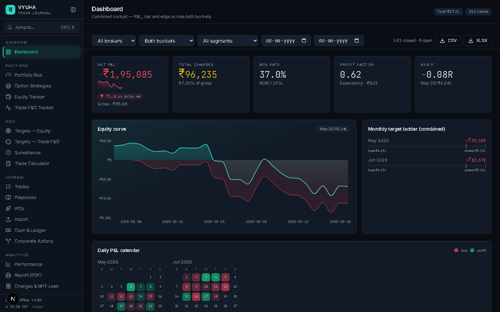
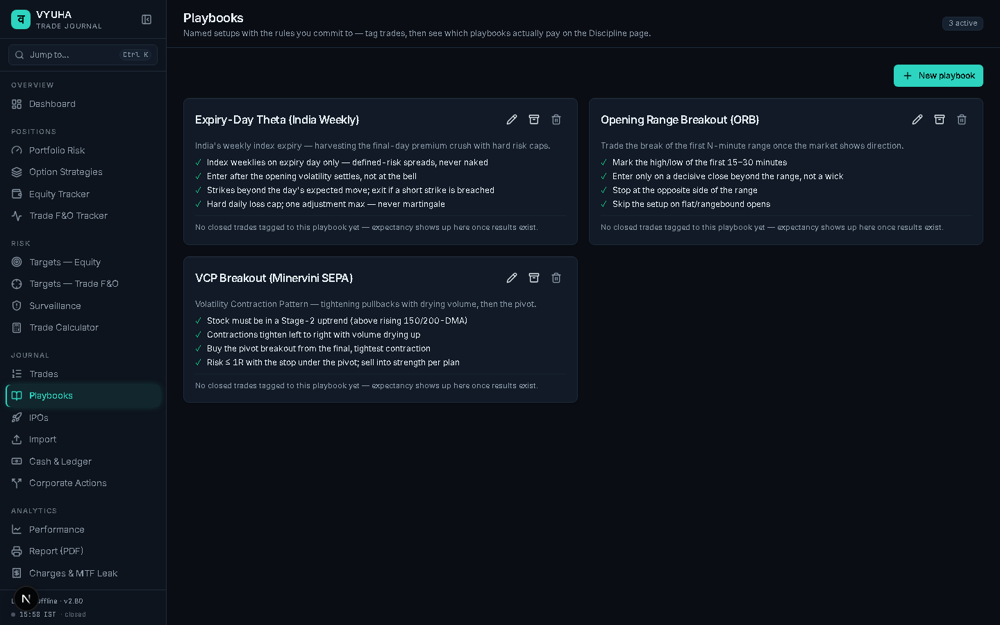
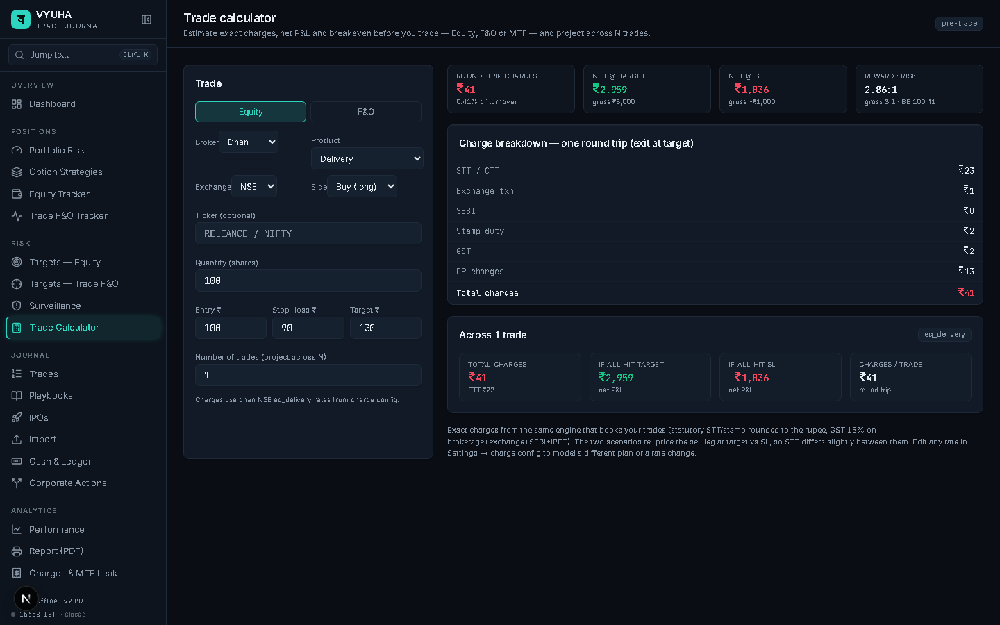

<div align="center">

# व Vyuha — The Trade Journal That Tells You the Truth

**A fully local, offline-first trade journal + analytics cockpit for Indian retail traders.**
Exact charges. Honest analytics. Zero cloud. Your data never leaves your machine.

[](https://github.com/Thejesh-k463/VYUHA-LOG/actions/workflows/ci.yml)
[](https://github.com/Thejesh-k463/VYUHA-LOG/tags)
[](tests)
[](#-get-it)
[](#-local-first-by-design)



*Dhan · Zerodha · Groww — Index/Stock Options, Intraday, Delivery, Equity MTF, MCX Commodities*

</div>

---

## Why Vyuha?

Most journals tell you your P&L. **Vyuha tells you why.**

- 🇮🇳 **To-the-rupee Indian cost engine.** STT, exchange txn, SEBI, stamp, IPFT, GST, DP, pledge — computed per **broker × segment × exchange** from an editable rate table, reconciled against real broker files. Money is stored as **integer paise** (no float drift), with statutory rounding.
- 💸 **MTF done right — the only journal that gets it.** Interest accrues on the *broker-funded portion only* (own-margin % is broker-specific: Dhan/Groww ≈25%, Zerodha ≈20%), with the **correct T+1 day-count** verified against Dhan's own docs. See ROI on your own capital, leverage, breakeven price, and a ⚠ flag when interest has eaten your entire paper gain.
- 📚 **Playbooks that enforce discipline, not just describe it.** 25 preset setups from trading ecosystems worldwide (ORB → Wyckoff → Minervini VCP → India's expiry-day theta), fully editable, plus your own. Tag a trade and its rules become a **followed/broken checklist** — the Discipline page then shows *which broken rule costs you the most ₹*.
- 🔍 **Honest analytics.** Expectancy cards warn you when the sample is too small to trust. The stop-tuning report says "descriptive, not prescriptive." Mistake economics report the expectancy *gap*, never fake counterfactuals. A SEBI reality-check card compares your F&O book to the published loss statistics.
- 🔒 **You stay in control — always.** Auto-MTM is opt-in. Update dialogs ask, never install. Breach alerts say *"check a live quote and review your plan"* — the app never places, closes, or changes anything on its own.
- 🖥 **Looks like a terminal, feels alive.** JetBrains Mono on every number, sparkline KPIs with week-over-week deltas, animated equity curve with crosshair, a magnitude-scaled P&L calendar, live IST market clock, `Ctrl+K` command palette — in three accent skins (**Terminal teal / Tape amber / Ice blue**), dark or light, with a colorblind-safe mode.

---

## ✨ Feature tour

### 📒 Journal every leg, effortlessly
- **Import** Dhan CSV, Groww XLSX, Zerodha CSV/XLSX, or PDF — auto-detected, de-duplicated, with a **charge reconciliation panel** (computed vs broker-reported) before commit. Zerodha **Kite API auto-import** for tradebook pulls.
- **Add / open / close / edit any trade, any time** — with a live charge preview from the same engine that books it, so what you see is exactly what gets saved.
- **Risk auto-computes from your SL** (|entry − SL| × qty), with manual override. **Current R** (live) and **Target R:R** (planned) side by side on every view.
- Chart **screenshot attachments**, emotion tags, mistake tags, notes — the full behavioral journal.

### 📚 Playbooks & discipline


- **25 preset playbooks across 7 global ecosystems** — Intraday & Momentum, Breakout & Trend (Turtle, Darvas, 52-week-high), Positional/Growth (CANSLIM, Minervini SEPA, Wyckoff, Weinstein), Mean Reversion (Connors RSI-2), Price Action/SMC (ICT liquidity sweeps), Options & Events (iron condor, **India weekly expiry theta**), Swing & Overnight (**BTST**). Pick one, tune every metric to your own risk, save.
- **Rule-checklist enforcement**: journaling a trade shows its playbook's rules — tick what you actually followed. Broken rules land on the Discipline page with their real cost.
- **Per-playbook expectancy cards**: win rate, net, expectancy, profit factor, avg R — with a small-sample caution until 20 closed trades.
- **Discipline scorecard**: weekly adherence scores, cost-of-mistakes rollup, trading-by-emotion, entry-time limit breaches, and the per-rule cost table.

### 🛡 Portfolio risk cockpit
- Live exposure: initial risk, open P&L, **open risk @ SL**, allocation, sector concentration (HHI), one-click trail-to-breakeven.
- **VaR / CVaR / parametric VaR**, beta-weighted exposure, NIFTY stress scenarios (±3%, ±5%, crash+IV spike).
- **Option Greeks** (Black-Scholes) with a three-tier IV fallback ending at the real **India VIX**.
- **Margin estimate** (SPAN approximation) per broker × segment, fully editable rate table.
- **Physical-settlement radar**: ITM stock options and futures near expiry get delivery-obligation and extra-STT warnings.
- **Pre-trade limits check** (per-trade cap, daily stop, max-open, concentration) — advisory with override, and overrides are *recorded* so you see what ignoring the guardrails cost.
- **SL/TSL/target breach alerts** on Dashboard & Risk with opt-in desktop notifications — every alert reminds you the marks are EOD/manual and to verify live.

### 🧮 Know your costs before you trade


- **Trade calculator**: exact round-trip charges, net-at-target, net-at-SL, charge-adjusted reward:risk and breakeven — equity, F&O, or MTF, projected across N trades.
- **Charges & MTF leak report**: where your gross P&L actually goes.
- **Broker cost comparison**: your entire history re-priced on every broker's rate card — see who'd have been cheapest.

### 📈 Edge analytics that don't flatter you
- Expectancy, win rate, avg R by **setup tag** and **segment**.
- **MAE/MFE excursions** from your own EOD price history, plus a **stop-tuning report** in R: how much heat your winners took, how many losers ran past 1R (late/moved stops — flagged as behavioral, not placement).
- Equity curve with max drawdown, daily P&L calendar, streaks, monthly target ladder, benchmark ingestion, Monte-Carlo utilities, XIRR.

### 🧾 India-grade tax tooling
- **Tax Summary**: STCG/LTCG with **31-Jan-2018 grandfathering** (per-share FMV), rate-cutover handling, dividend TDS tracking.
- **Advance tax** (234B/234C instalments), **tax-loss harvesting** scanner, **AIS/Form 26AS reconciliation**.
- **ITR Pack**: speculative vs non-speculative vs capital-gains segregation per FY, **ICAI Guidance Note turnover**, and a **44AB/44AD audit-applicability read** with layered cautions — export CSV/XLSX for your CA.

### 🔄 Automation — with your consent, never without it
- **Opt-in EOD auto-MTM**: once per trading day, fetch NSE's bhavcopy and mark open positions to close. OFF by default; warns that it overwrites matched marks; skips silently offline; every run is audit-logged.
- **MTF interest accrual** runs idempotently on app open.
- **Signed auto-updates**: the desktop app checks once at launch and shows *Update now / Later* — nothing ever installs itself, and your DB is **backed up automatically before any migration**.

### 🗃 Operational depth
IPO tracker with allotment P&L · capital compounding (double-count-safe) · cash & ledger · corporate actions · symbol aliases · instrument/sector master · surveillance-list warnings · immutable **audit log** · one-file **backup/restore** · command palette (`Ctrl+K`) · collapsible sidebar with live IST market clock · three accent skins + light/dark + colorblind-safe themes · toast notifications · animated, skeleton-loaded UI.

---

## 🔒 Local-first by design

No login. No cloud. No telemetry. No analytics SDKs.
Everything lives in **one SQLite file on your disk** — copy it and you've backed up your entire trading life. The desktop app talks to `127.0.0.1` and nothing else (except the two things you explicitly allow: update checks and opt-in bhavcopy fetches).

---

## 🚀 Get it

**Desktop (Windows):** grab `Vyuha_x.y.z_x64-setup.exe` from [**Releases**](https://github.com/Thejesh-k463/VYUHA-LOG/releases) — zero dependencies, Node.js is bundled. Every fresh install starts a **14-day full-Pro trial** (fully offline — no signup, no card), and the core journal is free forever. Your data persists in app-data across updates and reinstalls.

**New here?** Flip through the 📽 [**Getting-Started deck**](docs/GETTING_STARTED_DECK.html) — 12 visual slides covering install → import → journal → the playbook loop → Pro activation. (Download and open locally, or print to PDF; arrow keys navigate.)

**Run from source:**

```bash
git clone https://github.com/Thejesh-k463/VYUHA-LOG.git && cd VYUHA-LOG
npm install
npm run setup     # migrate + seed → ./data/vyuha.sqlite
npm run dev       # http://localhost:3000
```

---

## 🧪 Built like an engine, not a spreadsheet

- **440 unit tests** over pure, DB-free modules: charge engine, classification, MTF interest, capital gains, VaR, Greeks, settlement, discipline, ITR turnover, breach detection, MAE/MFE…
- Charges reconciled against **real broker files**; MTF math verified against **Dhan/Zerodha/Groww's own documentation**.
- Next.js (App Router) + TypeScript · Tailwind v4 · Drizzle ORM / better-sqlite3 · Recharts · TanStack Table · Tauri 2 desktop shell with a bundled-Node sidecar.
- Full changelog in [`CHANGELOG.md`](CHANGELOG.md).

<details>
<summary><b>📜 All npm scripts</b></summary>

| Script | What it does |
| --- | --- |
| `npm run dev` | Start the app on localhost:3000 |
| `npm run build` / `npm run start` | Production build / serve |
| `npm run setup` | `db:migrate` + `seed` in one go |
| `npm run db:generate` / `db:migrate` | Generate / apply Drizzle migrations |
| `npm run db:studio` | Inspect the DB in Drizzle Studio |
| `npm test` | Vitest unit suite (440 tests) |
| `npm run test:e2e` | Playwright happy-path e2e |
| `npm run typecheck` / `npm run lint` | `tsc --noEmit` / ESLint |
| `npm run bump-version x.y.z` | Sync the version across package/tauri/cargo/sidebar |
| `npm run desktop:build` | Build the native Windows installer (needs Rust; see below) |

</details>

<details>
<summary><b>🖥 How the desktop app works</b></summary>

Vyuha is a full-stack Next.js server (server actions + better-sqlite3), so it can't be a static
export. The Tauri shell spawns the Next **standalone** server as a **bundled-Node sidecar** bound to
`127.0.0.1`, waits for the port, then points the native WebView2 window at it. On first run the
launcher copies a seeded template DB (empty journal) into the OS app-data dir
(`%APPDATA%/in.vyuha.tradejournal`); your data persists there across updates and reinstalls.

```bash
# one-time prerequisites (Windows): Rust + WebView2 + MSVC C++ build tools
npm run desktop:build
# → signed installer at src-tauri/target/release/bundle/nsis/
```

Releases are built by CI on tag push (`v*`), signed with the updater keypair, and published as
**drafts** — updates only reach users when a draft is explicitly published.

</details>

<details>
<summary><b>⚙️ Configuration & data</b></summary>

- **Database:** `data/vyuha.sqlite` (git-ignored). Reset: delete `data/`, run `npm run setup`.
- **Capital model:** two buckets (Equity / Trade F&O), editable in Settings; every risk %, allocation and target computes against bucket capital, with opening snapshots kept in sync.
- **Nothing statutory is hard-coded:** all charge rates live in `charge_config` (broker × segment × exchange) and margin rates in `margin_config` (broker × segment) — both editable in-app, in Drizzle Studio, or via the seed files.
- **Known limits:** broker P&L files lack segment/MTF flags and per-trade dates — re-tag those rows once (overrides persist across re-imports). Brokerage/MTF interest can't be derived from scrip-aggregated files; the reconciliation panel surfaces the deltas.

</details>

<details>
<summary><b>🗂 Project layout</b></summary>

```
VYUHA-LOG/
  app/            # App Router pages (dashboard, risk, trackers, reports…)
  components/     # UI primitives, layout, feature components
  lib/
    engine/       # PURE classification + charges engines
    analytics/    # PURE metrics, tax, ITR, MAE/MFE, greeks, VaR…
    risk/         # PURE calculators, margin, alerts
    import/       # parsers, detect, dedup, commit pipeline
    jobs/         # MTF accrual, auto-MTM
    db/           # Drizzle schema, migrations, seed
  src-tauri/      # Rust desktop shell
  tests/          # 440 Vitest unit tests
```
Convention: business logic lives in pure modules with zero DB/React imports, unit-tested first,
then wrapped by thin server-only query layers.

</details>

---

## ⭐ If Vyuha saves you one bad trade…

…that's worth more than a star — but the star helps others find it. **[Star the repo](https://github.com/Thejesh-k463/VYUHA-LOG/stargazers)** and share it with a trader who still journals in Excel.

> **Disclaimer:** Vyuha is a journaling and analytics tool. Nothing in it is investment, tax, or
> legal advice. Charge/tax figures are computed from editable, documented rates and reconciled
> where possible, but your broker's contract notes and your CA remain the source of record.
