<div align="center">

# व Vyuha — The Trade Journal That Tells You the Truth

**A fully local, offline-first trade journal + analytics cockpit for Indian retail traders.**
Exact charges. Honest analytics. Zero cloud. Your data never leaves your machine.

[](https://github.com/Thejesh-k463/VYUHA-LOG/actions/workflows/ci.yml)
[](https://github.com/Thejesh-k463/VYUHA-LOG/tags)
[](tests)
[](e2e)
[](#-get-it)
[](#-local-first-by-design)
[](#-local-first-by-design)
[](#why-vyuha)

### ₹ Exact charges · 🧠 Honest analytics · 🔒 Zero cloud · 🇮🇳 Built for NSE/BSE/MCX

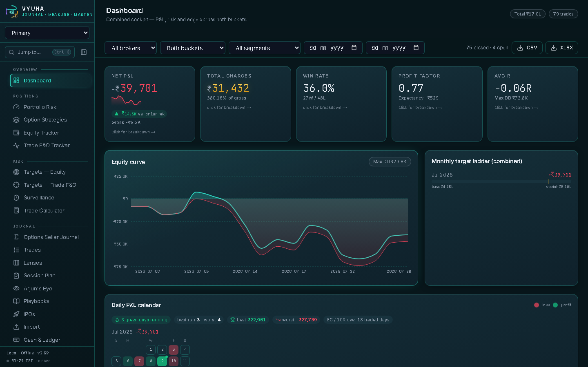

*6 auto-detected broker formats (Zerodha, Dhan, Groww, Angel One, Upstox, Paytm Money) + any CSV via the column mapper + 4 broker-API pulls (Kite, Dhan, Angel One SmartAPI, Upstox Analytics token) — Index/Stock Options, Intraday, Delivery, Equity MTF, MCX Commodities*

</div>

---

## Why Vyuha?

Most journals tell you your P&L. **Vyuha tells you why.**

> **Now: v3.2.0** — full history in [CHANGELOG.md](CHANGELOG.md). Landing page: https://thejesh-k463.github.io/VYUHA-LOG/
>
> **v3.2.0 — the journal stops guessing, and starts saying how sure it is.** Charge rates are
> now **effective-dated**: a rate row had no time dimension, so every trade of every vintage was
> priced at today's rate, and a book spanning the 1 April 2026 STT revision (NSE circular
> 02/2026 — options 0.10→0.15%, exercised options 0.125→0.15%, futures 0.02→0.05%) was priced
> wholly at the newer regime. Vyuha now keeps a dated history per rate and refuses rather than
> substituting when a date has none; **nothing re-prices on upgrade**. Every rate on the Edge
> report now carries a **Wilson confidence interval**, corrected across the whole table with
> **Benjamini–Yekutieli** — a 68% win rate on 15 trades spans roughly 42–86%, and slices that
> are not yet distinguishable from the book's own rate are marked and still shown. New
> **segment depth** separates the five books inside a book — Intraday, Delivery, MTF, Options
> (Index), Options (Stock) — and four columns the journal always captured and never read now
> answer when you exit, how long you hold, how many orders a position took, and **why** you
> closed it, crossed with how much of the move that exit caught.
>
> **v3.1.1 — an import says what it did with every row.** A tradebook states executions;
> Vyuha stores positions. The screen used to announce only the second number, so 7,544
> executions imported as "804" and read as data loss. Every import surface now states the
> arithmetic — **"7,544 executions → 804 positions (82 open, 72 opening sells without buy
> history)"** — and the rows whose P&L is legitimately "—" say why, and how to fill them in.
> A false *"conservation check FAILED"* on large correct imports is fixed: it treated four
> paise of paisa-rounding residue across 804 positions as a lost lot, with quantity conserved
> exactly. And numeric scrip codes now resolve through a bundled **5,671-security** snapshot
> of NSE, NSE Emerge and BSE listings, so SME-heavy books stop showing rows of numbers.
>
> **v3.1.0 — an account can leave the journal cleanly, and OpenAlgo gets a manual.** Every
> account in Settings now carries a Delete, with two coherent ends: delete everything the
> account owns, or **merge its journal into another account**, with a separate choice for its
> broker connections. A live server-computed preview shows the exact per-table counts, duplicate
> trades already in the merge target, and the warnings that apply, before a type-the-name
> confirmation arms the button. Deletions are **snapshot-first and transactional** — trades,
> ledger, IPOs, imports, sessions and capital history are recoverable from Deleted items, and
> restoring recreates the account; broker API credentials are never written to snapshots, and
> the dialog says so. Merges keep every trade link intact, skip and report duplicates, and carry
> the capital-compounding marker with arithmetic capped so it can neither double-count realised
> P&L nor go negative. **Import Help v2** opens each broker card as a full pop-up guide with
> verified per-broker OpenAlgo setup detail (Dhan and Upstox verified against live instances),
> pointing to two new client-package files: **OPENALGO_SETUP_GUIDE.html** and
> **OPENALGO_SETUP_GUIDE.docx** — a step-by-step multi-broker OpenAlgo manual built from real
> testing.
>
> **v3.0.0 — every connection knows its account, imports explain themselves, and speed is now
> measured.** The public-launch release. The all-accounts Import view now lists **every**
> connected broker API and OpenAlgo instance with a per-account label (it used to collapse
> silently to the first account's set), saving a connection asks which account it belongs to,
> and Pull & commit always books into the connection's own account — closing a latent
> cross-account write path. A new **Import Help** sidebar tab carries one expandable card per
> broker: which files import, where to download them (dated "as of Aug 2026"), and each API's
> full setup path — derived from the import registry and guarded by a test. And a performance
> pass measured on a new **42-route benchmark against a seeded 25,000-trade book** took Cash &
> Ledger from **27.3 s to 0.9 s** (the page was serializing a 113 MB response — sums and the
> running balance moved into SQL, the table pages at 200 rows), corporate actions 1.6 s → 0.7 s,
> the dashboard 1.9 s → 1.3 s, the overall route median 1,195 ms → 987 ms, and console errors
> 3 → 0 — with `npm run perf:seed` + `npm run perf:sweep` shipping as the harness that keeps it
> honest. Six payload-bound routes remain above the internal 1.5 s budget at that abusive tier;
> they render correctly and are scheduled as v3.0.x pagination work.
>
> **v2.99.104 — Upstox connects natively, and duplicate pulls explain themselves.** The fourth
> broker-API pull, on the best credential of the four: Upstox's **Analytics token** lasts a year
> and is **read-only by design** — it cannot place orders, even in principle. Built and verified
> against a live account the same day (11 real fills across NSE/NFO/BFO; weekly option symbols
> canonicalised from three live contracts; MTF arriving as the stated product), then
> cross-checked against a second, independent pull of the same day — **every trade matched to
> the exact hash**. That test surfaced the release's other feature: a commit that would add
> nothing now opens a dialog listing each already-recorded trade instead of a one-line skip
> note; risky near-miss duplicates keep their blocking warning; ordinary re-pulls stay nag-free.
> Also fixed on the way: Vyuha forces Upstox requests onto IPv4 (the API is dual-stack, and
> Upstox's Static-IP gate rejects the IPv6 path a default fetch takes — found live, coded
> around, explained in the connection's help text).
>
> **v2.99.103 — Angel One's live pull books F&O correctly, verified against its contract note.**
> The first Angel One pull to return fills verified the row shape and fixed the known
> F&O-as-equity defect from the broker's stated fields — the payload's own SENSEX symbol carried
> a different date than its stated expiry, so symbol-parsing would book the wrong day. A real MTF
> trade arrived as `producttype: "MARGIN"`, now mapped to MTF. The contract note reconciled all
> six trades to the fill time.
>
> **v2.99.102 — the first live F&O pull, and everything it taught.** The first broker-API pull ever
> to return real F&O fills ran on 2026-08-26 against a live Dhan account, supervised end to end and
> reconciled against the broker's signed contract note — **all 9 contracts to the 4th decimal, STT
> exact to the paisa, non-brokerage levies within 0.081%**. It found real defects and this release
> ships their fixes: F&O positions pulled through the Dhan API used to classify as *equity* (wrong
> STT, wrong segment, invisible to options analytics) — derivative names are now built from the
> facts Dhan itself states, never guessed from symbol shape; open positions arrive **already
> valued** with the broker's own mark; and a pull that looks like trades already in your journal
> now **stops before committing** and shows you exactly which rows collide — the same contract at
> two different brokers still imports as the two real trades it is. Also: Portfolio Risk shows
> rupees beside percentages, and an inline price box replaces the dead-end "enter a current price"
> link. The same classification defect is known and still open for Zerodha/Angel One **API** pulls
> (their file imports were always correct) — it is fixed the day a real F&O payload exists to
> verify against, because guessing is how journals lie.
>
> **v2.99.101 — a closed position explains itself instead of dead-ending.** Booking an exit on a
> fully closed staged position offered percentage shortcuts of nothing and a native `max=0`
> constraint whose "Value must be 0." blocked every quantity before the ladder's own message could
> surface. The dialog now says the position is closed and names the two real paths — add an entry
> to re-open it, or remove the wrongly-booked exit leg and book what actually happened. The button
> stays enabled throughout: the panel warns; it does not decide.
>
> **v2.99.100 — imports stay proportional as a book grows; the pairing engine was quadratic.** The
> FIFO walk that turns fills into positions cost **three O(lots) scans per sell** — a full-queue
> pass for same-day lots, `.some()` *and* `.find()` re-scanning inside the oldest-first loop, and a
> `splice` compaction — so a queue that grows (buys outnumbering sells) made the walk **O(n²)**.
> Found by a new load case, `tests/load/c8-pairing-depth.load.ts`, written because an import-graph
> scan showed **none of the thirteen existing load cases imported the module at all**: one symbol at
> 8,000 legs → 79 ms and 32,000 → 1,249 ms, a **15.89× cost for 4× the legs**. A forward-only head
> pointer plus a per-date index brings that to **3.70×**, and 50,000 legs on one symbol from
> **775 ms to 63 ms** — with byte-identical output, proven by 1,920 unit tests and by both
> real-broker reconciliations (Paytm's 414 executions against Paytm's own realised-P&L statement,
> and a 1,554-fill Zerodha Console tradebook). Multi-symbol books were never affected: that path
> measured 4.19× with per-item cost flat throughout.
>
> **v2.99.99 — Angel One's live pull works again; it had been refusing since v2.99.80.** Pressing
> **Pull** on an Angel One connection answered *"the saved credentials cannot be read"* and never
> reached the network — on every shipped build from v2.99.80 up to and including the published
> v2.99.98. Angel One is the only broker that collects **no access token** (it mints the day's login
> code from your enrolled TOTP secret), so the vault held an *encrypted empty string*, whose
> zero-length ciphertext `parseVaultString` correctly rejects as malformed — and the pull's guard
> demanded a readable token **before** dispatching to any broker, refusing on one Angel One never
> asks for. The guard now requires a token only where the broker table says one is collected; the
> vault format is unchanged, because refusing an empty ciphertext is the right behaviour, and
> `tests/vault.test.ts` pins the trap. **Nothing needs re-entering.** Also shipped: the Help Desk's
> "eight brokers", the Dashboard's "five brokers" and the column mapper's plain-FIFO description
> now match the code, and `tests/readme-claims.test.ts` reads its test and screenshot counts off
> disk instead of comparing its six figures only to each other — which is how 1,858/128 stayed
> green against a suite at 1,920/131.
>
> **v2.99.98 — Tradebooks import as the trades you made, verified against a real broker statement.** Zerodha and Paytm Money
> tradebooks are paired **per scrip and day — same-day buys and sells net into one intraday trade first, the rest FIFO** —
> so a quarter of fills no longer collapses into one row per symbol; sells of shares bought before the window are
> **opening sells with the P&L left blank**, never a 100% gain. Zerodha fill times now come from *Order Execution Time*.
> Paytm's `EQ`-only product column is replaced by the product Paytm's own STT/stamp duty imply per day, its six charge
> components travel with each trade, and its numeric scrip codes resolve to tickers through the ISIN. Reconciled against
> Paytm's realised-P&L statement: 47 of 52 scrips within ₹25, total within 1.4%. Upstox trade report and realised P&L
> are recognised by the legal name in A1 (schema verified; values unverified — no rows yet). Same-day-first pairing
> applies to Dhan GTR, Groww order history and the column mapper too.
>
> **v2.99.97 — Appearance becomes a set of dials.** A **tint intensity** slider (0–100, Subtle /
> Balanced / Vivid) decides how much of the skin's hue the canvas, sidebar, cards and borders
> wear — tuned so every skin holds ≥9:1 (dark) / ≥7:1 (light) body-text contrast even at 100.
> A **panel style** (Flat / Soft / Luxe / Glow), a **wallpaper** (PNG/JPEG/WebP ≤12 MB, kept out
> of backups, scrimmed per theme, never printed) and a ninth skin, **Custom** — seven colours ×
> dark/light with a readability badge on each, seeded from any built-in skin. The tokens are
> computed by a pure engine and injected inline on `<html>`, so there is no flash and charts
> stay literal-colour. Also: the buy buttons open a copyable WhatsApp dialog inside the desktop
> shell, and reinstalling over a running copy no longer errors on `node.exe`.
>
> **v2.99.96 — eight skins that tint the whole screen.** Ice and Royal are retired (they shared
> hexes with Sapphire and Luxe/Aurora and were telling only by their buttons; a stored choice
> maps to Sapphire). In their place **Lime**, **Rose** and **Ember** — and every coloured skin
> now tints canvas, panels and borders in its own hue, so the roster is Luxe, Terminal, Tape,
> Sapphire, Aurora, Lime, Rose, Ember, with a test that no two share a primary or an
> analytics-vs-primary hex.
>
> **v2.99.95 — launch pricing that survives division, and a comparison that hides nothing.**
> List prices are ₹13,000/yr (Pro — Annual) and ₹35,999 (Journal — Lifetime), effective
> 2027-01-01; until then the launch offer sells at ₹9,999/yr and ₹29,999, and the savings
> badges are computed and floored — **23% off** and **16% off**, never rounded up. Lifetime is
> now the featured plan and lists the roadmap. The pricing and landing pages carry a
> seven-product comparison read from public pages on 2026-08-15, with "not stated" wherever a
> claim could not be verified — the ₹999–₹2,499 Indian competitors included. macOS selling
> claims came off every surface (the Mac edition will be offered separately), the current
> mark replaced the retired flat tile everywhere, and the refund policy states its edges.
>
> **v2.99.94 — the renewal you were never warned about, and four claims that were not true.**
> An annual licence now warns from 30 days out — a dated countdown and a renew link on every
> Pro screen, nothing withheld while it counts down, and the journal itself is unaffected by
> expiry either way. PDF is no longer described as an importer (it reads a broker PDF's text
> so you can enter trades by hand; it produces no trades), prices no longer claim to include
> tax, the download promise says "private link" because a 35 MB installer cannot be emailed,
> and a refund policy, terms of use and privacy statement now ship inside the download. For
> the seller: a licence term must be stated explicitly and a paid key needs its payment
> reference before it can be issued.
>
> **v2.99.93 — five things that only showed up under load, two of which lost data.** A load
> and stress suite now exists, and its first six tests found five real defects. Screenshot
> thumbnails no longer vanish on restore (they had no database row, so backups never carried
> them — take a fresh backup after updating), deleting a large account no longer trips
> SQLite's 32,766-parameter limit (a 2,000-trade delete went from 4,010 statements to 29),
> and rebuilding a staged ladder is one all-or-nothing write instead of a half-repriced
> position. Import preview is 364× faster on a 25,000-trade book (8 s → ~20 ms) and Data
> Quality 31× faster when symbols are not price-marked (10 s → fast), with case-insensitive
> symbol matching so a fresh mark is never reported stale.
>
> **v2.99.92 — the same app as v2.99.91, shipped by a pipeline that now works.** No behaviour
> changed. v2.99.91's Windows job died on the release gate, so it published with macOS assets
> only and no `Vyuha_x64-setup.exe`; everything below reaches a Windows machine for the first
> time here. The cause was a DPAPI round-trip test — the one test that spawns a real process,
> two cold `powershell.exe` starts — timing out against vitest's 5s default on a cold runner.
>
> **v2.99.91 — a withdrawn licence now stops working before the next release.** Revocation
> was a build-time list: a refunded or leaked key kept working until the user happened to
> install a newer build. It now also travels as an **Ed25519-signed list** the app picks up
> during the version check it already ran at every launch. The list goes **down and nothing
> goes up** — no key id, no machine id, no account in the request; the same public file is
> served to everyone. It **warns before it locks** (a dated countdown on the Pro screens for
> the grace window, with nothing withheld), it is **reversible** by publishing a newer list,
> an **older list can never undo a newer one**, and it **fails open** offline. Two limits are
> written down rather than hidden: a permanently offline machine never receives it, and none
> of this survives a patched binary. Shipping it meant retiring four in-repo promises that no
> such mechanism would exist and correcting three published claims that described the launch
> update check as optional — [see below](#-local-first-by-design).
>
> **v2.99.90 — the first broker that connects itself every morning.** **Angel One** joins
> Zerodha and Dhan for live API pulls — and unlike either, nothing expires on you: each pull
> mints the day's login code from your enrolled **TOTP secret**, so one click after the close
> brings in the day's fills. The integration is **read-only by construction** — it can log in
> and read the trade book, nothing else, and the test suite pins that export list so a trading
> capability cannot be added without failing CI. The TOTP engine is forty lines of `node:crypto`
> pinned to **RFC 6238's own test vectors**; no new dependency.
>
> **v2.99.80 — what the database file knows, it no longer tells.** Every stored secret — the
> licence key and all broker credentials — is now encrypted with a key the database does not
> hold: **DPAPI-wrapped** to your Windows profile, or a machine-identity KDF on macOS/Linux. The
> `.sqlite` file alone, copied or synced or shared, carries nothing usable. Backups stop
> carrying credentials entirely, and on a new machine the app asks you to re-paste rather than
> breaking. The honest boundary, stated in the docs: this defends the file at rest, not a
> compromised machine — no user-mode design does, keychains included.
>
> **v2.99.77 — the boundary holds everywhere.** Eleven defects, most of them one disease: code
> touching an account-scoped table without resolving which account it was in. Session plans can
> no longer drift across accounts from a stale tab; IPOs land where you'd expect and refuse
> cross-account edits; every staged-leg mutation runs the delete engine's own-account guard.
> IPO exit charges now price through the **charges engine and your editable rate card** instead
> of rates frozen in source. And the guard tests can now *fail*: the account registry maps every
> scoped table to owner files that must resolve the account, catching a real distinction on its
> first run.
>
> **v2.99.76 — the price becomes the positioning.** Two plans, stated plainly in-app for the
> first time: **Pro — Annual ₹9,999/yr** and **Journal — Lifetime ₹29,999**, with the free tier
> free forever. Prices carry the date they were set and the buy message quotes exactly what you
> saw, because an offline app quoting a price is a promise the seller has to keep.
>
> **v2.99.75 — six brokers auto-detect, deletion grows an undo, and the book gets lenses.**
> Import detection was rebuilt on **in-content fingerprints** after a real misroute — every
> broker parser must now prove whose file it holds before it claims one, and a file that names
> no broker gets a question, never a guess. That rebuild carried three new formats in with it:
> **Paytm Money tradebook** (per-execution with the broker's own charges), **Angel One tax
> P&L** (seven sub-tables, explicit MTF quantities), and **Groww order history**. Deleting
> became something you can reason about: every delete now writes a **snapshot first** — trades,
> legs, chart attachments and all — restorable from Backup & Restore → Deleted items, and new
> scopes (date range, current view, one broker, one file) all pass through the same
> show-exactly-what-goes confirmation. The new **Lenses** screen cuts the same book six ways —
> month, broker, trade type, import file, setup, outcome — with per-group performance, and the
> app finally answers "how much?" in-app: real prices on the upsell panel and a pricing page.
>
> **v2.99.70 — seven skins, and the chrome grows reflexes.** Three new accent skins — **Royal**
> (regal violet, since retired), **Sapphire** (electric indigo with orchid analytics), **Aurora** (fuchsia with
> teal) — each a measured triple like the original four: same contrast floors on both themes,
> money/analytics roles kept far apart on the hue wheel, P&L colours untouched. Around them the
> chrome sharpened: real 300 ms tooltips replace the browser's slow title bubbles on the hot
> surfaces, the Ctrl+K palette became a true dialog (focus trap, scroll lock), and the animated
> count-up numbers rolled out from the dashboard to the report and tracker screens.

<p align="center">
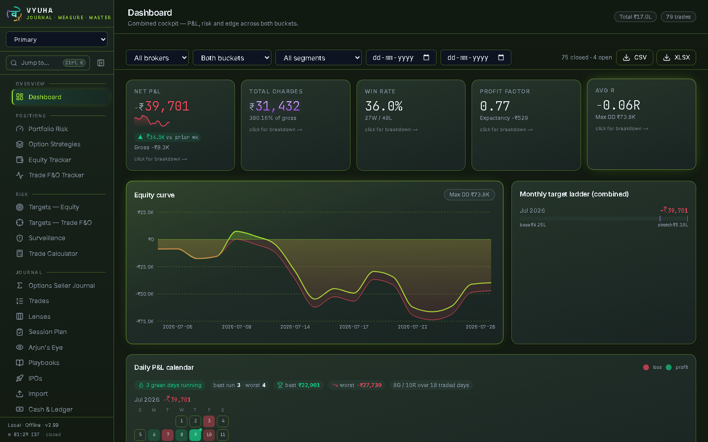
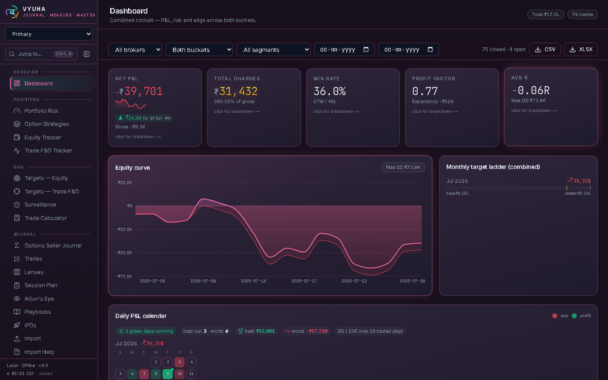
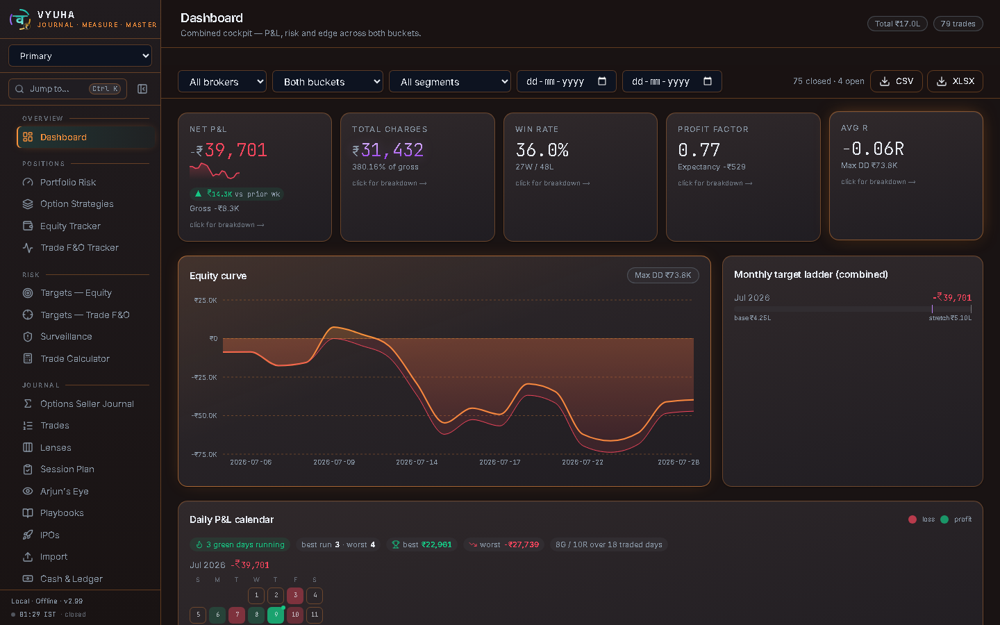
</p>
<p align="center">
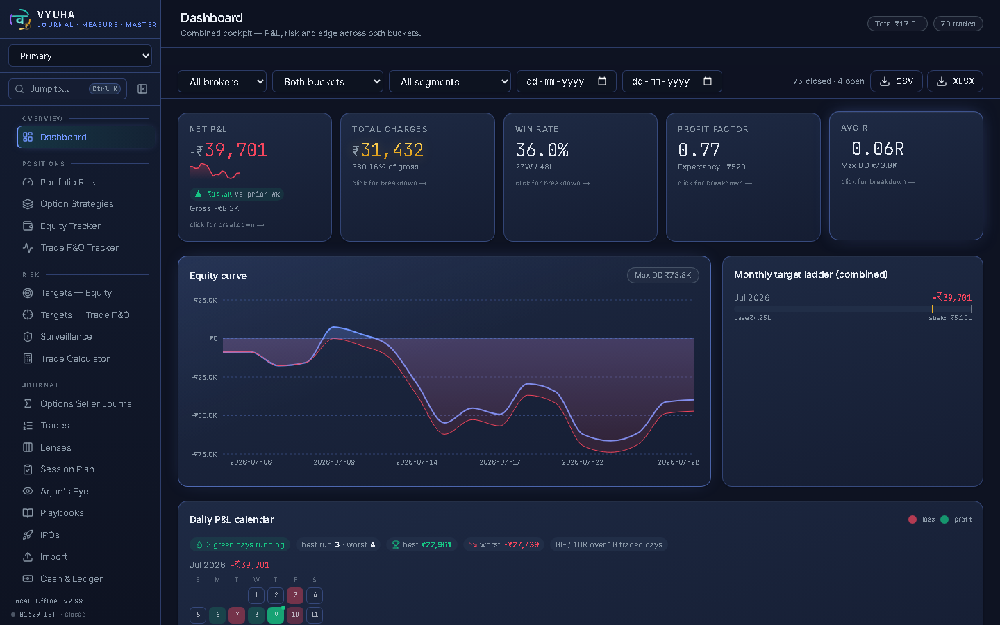
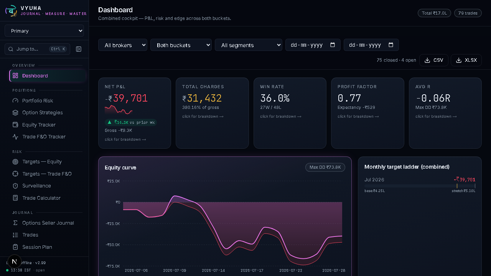
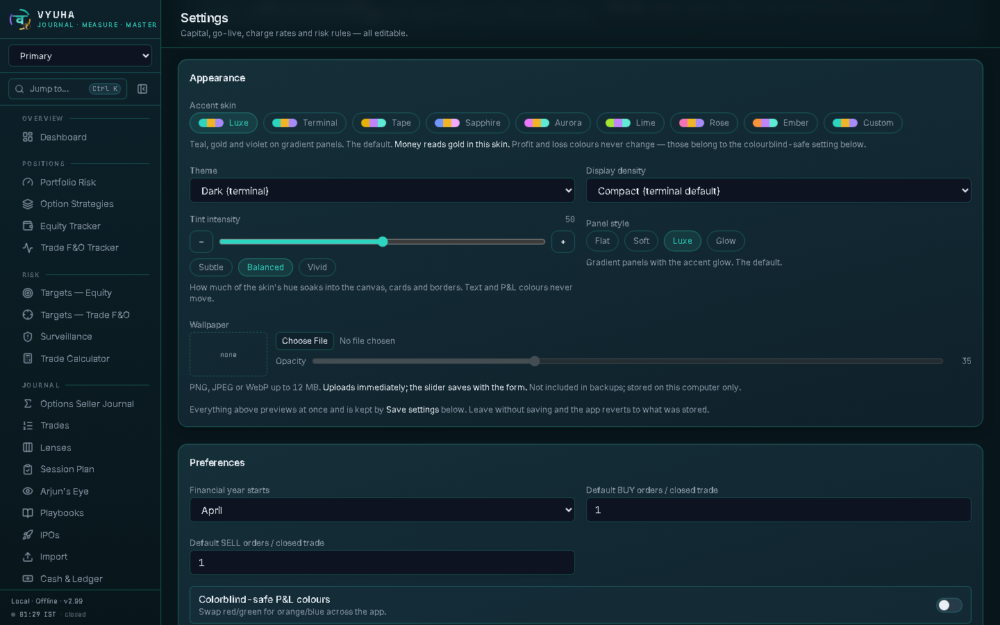
</p>
>
> **v2.99.60 — built for the ten-thousand-trade book, dressed to match.** Three engineering
> releases: the Trades table now virtualizes and ships 44% less data (measured — an ~10k-trade
> book stays instant), the hottest queries went from filesort to index scan, and every report
> screen now wears the same table chrome, feedback voice and empty-state language as the rest of
> the app. Print pagination works, dialogs keep Save on screen, a fresh install greets you with a
> next step instead of five ₹0 tiles.
>
> **v2.99.45 — it remembers how you trade, and it survived a forensic audit.** Every feature was
> audited against real journal data before this build — money identities across every row, all 40
> screens rendered live, an adversarial read of every changed file — and the three defects found
> (a half-rupee rounding edge, a viewer that could reopen uninvited, a file variant that could
> silently clear a surveillance category) are fixed and pinned by tests.
>
> **v2.99.40 — it remembers how you trade.** The calculator keeps a separate last trade for
> Equity and for F&O — with an index picker that knows the January-2026 market lots (Nifty 65,
> Sensex 20…) and which exchange each index calls home. Surveillance now reads NSE's own files:
> drop `fo_secban.csv` or the `REG_IND` indicator file and ban/ASM/GSM/ESM land in the right
> categories with the date read from the file itself. Chart screenshots open in an in-app viewer.
> Trades columns reorder by drag. Four coordinated skins — Luxe, Terminal, Ice (since retired → Sapphire), Tape — in dark and
> light. And the installer wears the Vyuha mark end to end, not the NSIS globe.
>
> *v2.99.9 — every broker's MTF list, compared.* 10,501 per-stock own-margin percentages across
> all seven brokers, each from the broker's own feed — and a Broker Costs section that prices
> **your** delivery/MTF symbols on every list, cheapest broker highlighted (Sahi listed honestly:
> no MTF delivery). Approved-but-unfunded scrips are declared, never disguised as funded.
>
> *v2.99.8 — MTF that knows your broker's list.* 3,083 per-stock own-margin percentages from
> the brokers' own published MTF lists (Zerodha and Paytm Money complete; partial/rule-based
> coverage declared honestly for the rest). The Trades form auto-splits your capital vs
> broker-funded the moment you enter price and quantity — both sides editable, each deriving the
> other — and Portfolio Risk flags open MTF positions whose current requirement has drifted since
> entry. Plus: chart screenshots attach at trade entry, and selected trades export as a PDF report.
>
> *v2.99.7 — sectors in one click, and edge by theme.* A bundled snapshot of NSE's 54 index
> constituent lists (~1,150 symbols with official industry, ISIN and thematic memberships) fills
> your instruments master in one click — sector concentration works with zero typing, and your
> hand-typed tags are never overwritten. The Edge report gains a **theme lens**: expectancy per
> thematic index (Defence, Railways PSU, EV, Digital…), honestly labelled — themes overlap, thin
> samples are flagged, and the untagged remainder is reported.
>
> *v2.99.6 — files in, typing out.* Instruments fill from NSE's own files (bhavcopy /
> EQUITY_L / F&O market lots — with in-app guidance on where each lives), corporate actions
> import from the CF-CA CSV with every reading shown for verification before applying, symbol
> aliases take a CSV, and AIS reconciliation parses the income-tax portal's JSON download
> directly. The audit log now groups by what happened — your edits are no longer buried under
> auto-MTM maintenance rows. And the first-run database is finally anonymous: zero capital,
> go-live stamped on first launch.
>
> *v2.99.5 — Vyuha gets its mark, and tables you can actually read.* The Devanagari **व**
> hanging from an edge-to-edge shirorekha — the letter's headline stroke doubling as a price
> level — now ships as the installer icon, favicon, sidebar and share-card mark, generated from
> one committed glyph outline (Noto Sans Devanagari, SIL OFL) so no surface depends on the
> user's fonts. Every table gained visible row rules (the old separators measured 1.08:1 —
> below what the eye registers), a proper uppercase header band, a pinned Instrument column,
> truncated option names, and a **Compact/Comfortable display density** setting. Light-mode
> primary now passes WCAG AA.
>
> *v2.99 — Vyuha runs on a Mac, and the journal cleans up after itself.* Native builds for
> Windows, macOS Apple silicon and macOS Intel. A **Help Desk** describing every screen — including
> what each deliberately won't do. **Honest deletion**: select rows, delete an imported file (with
> the its-trades question asked, never assumed), batch scopes by date/broker/segment — every delete
> previews the exact set first and audits the full before-snapshot. **Cross-source duplicate
> detection** stops a P&L export silently double-recording trades a transaction report already
> supplied. **My Default Settings** restores your baseline in one click — preferences and rate
> tables, never licence or accounting state. Seller depth: expectancy by DTE band, hedged-vs-unhedged
> as an honest gap, roll chains against the first leg, IV rank, premium per day of risk. And the
> licence clock is now a ratchet — winding the system clock back no longer renews a trial.
>
> *v2.98 proved the safety net (atomic restore, stronger backup crypto, aggregate-view write
> guards) and added the ITR schedule-format export with the S.48 STT rule applied per head.*

- 🇮🇳 **To-the-rupee Indian cost engine.** STT, exchange txn, SEBI, stamp, IPFT, GST, DP, pledge — computed per **broker × segment × exchange** from an editable rate table, reconciled against real broker files. Money is stored as **integer paise** (no float drift), with statutory rounding.
- 💸 **MTF done right — the only journal that gets it.** Interest accrues on the *broker-funded portion only* (own-margin % is broker-specific: Dhan/Groww ≈25%, Zerodha ≈20%), with the **correct T+1 day-count** verified against Dhan's own docs. See ROI on your own capital, leverage, breakeven price, and a ⚠ flag when interest has eaten your entire paper gain.
- 📚 **Playbooks that enforce discipline, not just describe it.** 25 preset setups from trading ecosystems worldwide (ORB → Wyckoff → Minervini VCP → India's expiry-day theta), fully editable, plus your own. Tag a trade and its rules become a **followed/broken checklist** — the Discipline page then shows *which broken rule costs you the most ₹*.
- 🇮🇳 **Knows today's SEBI regime.** A compliance radar reads your open book against the post-2024 F&O rules — the **+2% expiry-day ELM** on short options expiring today, the **loss of calendar-spread margin benefit** on expiry, which indices still have weeklies, and how close your index exposure sits to the ₹1,500 cr limit that's now snapshotted *intraday*. No other journal tracks this.
- 🔍 **Honest analytics.** Expectancy cards warn you when the sample is too small to trust. The stop-tuning report says "descriptive, not prescriptive." Mistake economics report the expectancy *gap*, never fake counterfactuals. A SEBI reality-check card compares your F&O book to the published loss statistics.
- 🔒 **You stay in control — always.** Auto-MTM is opt-in. Update dialogs ask, never install. Breach alerts say *"check a live quote and review your plan"* — the app never places, closes, or changes anything on its own.
- 🪜 **Positions built the way you actually trade them.** Scale in across tranches with a stop on each, scale out in parts, and see per-leg R — with exits priced at the blended average, quantity retired FIFO so the surviving tranche keeps its own stop, and R frozen at your first entry so it stays comparable. Broker tradebooks rebuild the ladder automatically.
- 🔬 **Every KPI explains itself.** Click any headline number — Net P&L, Open Risk @ SL, MTF funded, Unrealised P&L — and it opens a breakdown of what it's actually made of: gross minus every charge with your best and worst day, open risk sitting next to initial risk with the unstopped-position count, effective leverage and how much of your paper gain financing has already eaten. Sixteen cards, keyboard-accessible.
- 🖥 **Looks like a terminal, feels alive.** JetBrains Mono on every number, sparkline KPIs with week-over-week deltas, animated equity curve with crosshair, a magnitude-scaled P&L calendar, live IST market clock, `Ctrl+K` command palette — dark or light, nine skins with a tint dial, and a colorblind-safe mode.

---

## 📊 At a glance

<div align="center">

| | | |
|:--:|:--:|:--:|
| **10,501** | **7** | **0.69%** |
| per-stock MTF margins bundled | brokers' MTF lists compared<br/>(Sahi has none — it offers no MTF delivery) | charge-engine error vs a real broker report |
| **2,542** | **43** | **0** |
| tests, 45 end-to-end flows | screens, all offline | bytes of *your data* ever uploaded |

</div>

> **Read that third number again.** On a real 92-row broker report, Vyuha's computed statutory
> charges land within **0.69%** of the broker's own — STT, exchange, SEBI, stamp, IPFT, GST, DP and
> pledge, per broker × segment × exchange, in integer paise with statutory rounding. Brokerage is
> excluded from that claim because it isn't derivable from the file. We say so rather than pad the
> number.
>
> And it keeps being re-proven: on 2026-08-27 a live Dhan API pull was reconciled against the
> broker's **signed contract note** — all 9 contracts matched to the 4th decimal, STT to the exact
> paisa (₹1,222.00 vs ₹1,222.00), and non-brokerage levies landed within **0.081%**.

---

## 💸 What's free, what's paid

**Your record is free. The intelligence about it is paid.**

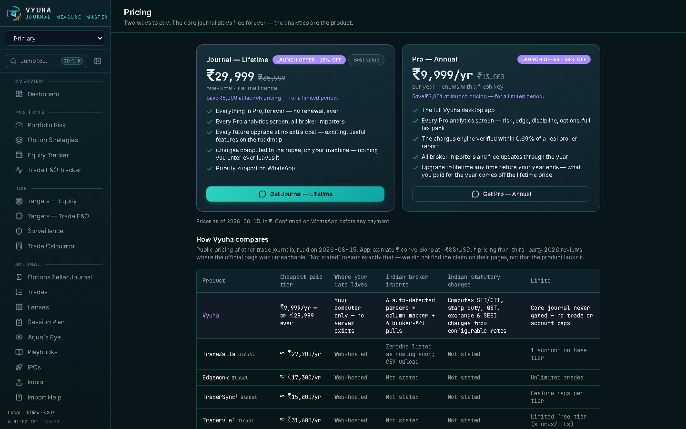

**Pro — Annual ₹9,999/yr · Journal — Lifetime ₹29,999**, launch prices (list ₹13,000/yr and
₹35,999 from 2027-01-01). Both are quoted in-app with the date they were set, and the buy message
embeds the price you saw.

| ♾ Free forever | 🔑 Pro |
|---|---|
| Recording **closed** trades — add, edit, delete, tag | **Live open-position tracking** — SL/TSL/target, running risk |
| All six broker importers + duplicate detection | Portfolio Risk cockpit — VaR, Greeks, margin, breach alerts |
| Dashboard, P&L calendar with day drill-down & streaks | Arjun's Eye, Edge/Setups, Discipline, Scaling & Replay |
| Staged positions, playbooks, sessions, calculator | Options Seller Journal, Expiry Analytics, Return on Margin |
| Chart screenshots, symbol aliases, corporate actions | Tax Summary, ITR Pack, Advance Tax, Harvest, AIS Reconcile |
| Backup & restore, full CSV/JSON export, audit log | Broker-cost + cross-broker MTF comparison, Charges & MTF Leak |
| Workspace mode, sidebar layout, appearance (skins, tint, panels, custom theme, wallpaper), multi-account | PDF reports — monthly, and any hand-picked selection of trades |
| **Lenses grouping** — by month/broker/type/file, with delete | **Lenses edge** — per-group win rate, profit factor, expectancy |
| **Recoverable delete** — every delete snapshots first, restorable | |

Every fresh install starts a **7-day full-Pro trial** — offline, no signup, no card. When it ends,
**every trade you have already recorded stays readable, editable and exportable without a key,
forever.** Your own record of your trading is never held hostage.

---

## ✨ Feature tour

### 📒 Journal every leg, effortlessly
- **Import from ANY broker.** Six are auto-detected — **Dhan** (P&L *and* the charge-carrying Global Transaction Report), **Groww** (stocks P&L *and* order history), **Zerodha** (tradebook and Console P&L), **Angel One** (tradebook, P&L, *and* the seven-section tax P&L with explicit MTF quantities), **Upstox**, and **Paytm Money** (per-execution tradebook with the broker's own charge breakdown). (A broker PDF is read for its text only — no PDF layout has been calibrated, so it never imports a trade, and the import screen says so.) Detection keys on **in-content fingerprints**, never on filename or column shape: every parser must prove whose file it holds before claiming it, and a cross-broker refusal matrix in the test suite keeps it that way. For every other broker — **Kotak Neo, Sahi**, or one that launches next year — drop the CSV/XLSX and Vyuha asks you to **match the columns once**, then remembers the mapping. Nothing is ever guessed: a file whose layout is unknown produces a question, never a trade with quantity in the price field. Mapped tradebooks go through the same FIFO pairing, de-duplication and charge engine as native ones, with the **charge reconciliation panel** (computed vs broker-reported) before commit. Live API pulls too: Zerodha **Kite**, **Dhan**, **Angel One SmartAPI** — fully unattended, its daily login minted from your TOTP secret — and **Upstox** on its year-long, read-only Analytics token, all credentials encrypted at rest.
- **Brokers with no API of their own — Groww, Paytm Money, Kotak — can pull live through [OpenAlgo](docs/OPENALGO_SETUP.md)**, an open-source bridge you run on your own computer. Deliberately **off by default** behind an in-app disclosure, because it means running one more program that holds a broker credential: your credentials go into OpenAlgo, never into Vyuha; the data flows only from your broker to your machine; Vyuha's pull is read-only and goes through the same preview → charges → duplicate-check pipeline as every file. The integration was verified live against brokers' own contract notes before this line was written — the full setup guide is [docs/OPENALGO_SETUP.md](docs/OPENALGO_SETUP.md).
- **Lenses — the same book, cut six ways.** One tab strip re-groups every trade by month, broker, trade type, import file, setup or outcome — so "what exactly did that one file produce?" is one click, in isolation, with that group's own P&L and charges (and, with Pro, its win rate, profit factor, expectancy and average R). Any group can be deleted from right there.
- **Deletion you can reason about — and undo.** Delete by date range, by import file, by broker, by trade type, or exactly what the table is showing; every path goes through one confirmation that shows the precise set, counts and net P&L before anything happens, with type-to-confirm past ten trades. And every delete writes a **snapshot first** — trades, staged legs, chart attachments and all — restorable from **Backup & Restore → Deleted items**. Snapshots are never auto-purged.
- **Back, everywhere it means something.** A back control appears in the header only when there is an in-app screen to return to (labelled with where it goes), Alt+← and the mouse's back button work in the desktop shell, and drill-downs carry their own in-page back.
- **Add / open / close / edit any trade, any time** — with a live charge preview from the same engine that books it, so what you see is exactly what gets saved.
- **Risk auto-computes from your SL** (|entry − SL| × qty), with manual override. **Current R** (live) and **Target R:R** (planned) side by side on every view.
- Chart **screenshot attachments**, emotion tags, mistake tags, notes — the full behavioral journal.

### 🔭 Lenses — the same book, cut six ways
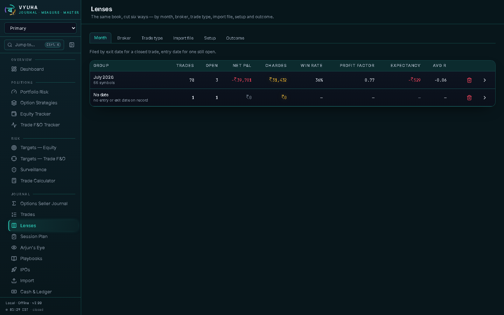

- **One tab strip, six regroupings** — by month, broker, trade type, import file, setup or outcome — each showing that group's own **net P&L, charges, win rate, profit factor, expectancy and average R**. When an import looks wrong, the *Import file* tab shows exactly what that one file produced, in isolation, and deletes just that group from where you are standing.
- **Every cut is a partition, and the tests prove it**: each trade lands in exactly one group and the groups add up to the whole book. Trades with no usable date, no setup recorded, or an import record that was deleted get their own honest group rather than being quietly dropped.
- What a group **counts** is what deleting it **removes** — the confirmation resolves the same ids the group was built from, so the number you read is the number that goes.

### 🔌 Connect a broker — and Angel One connects itself
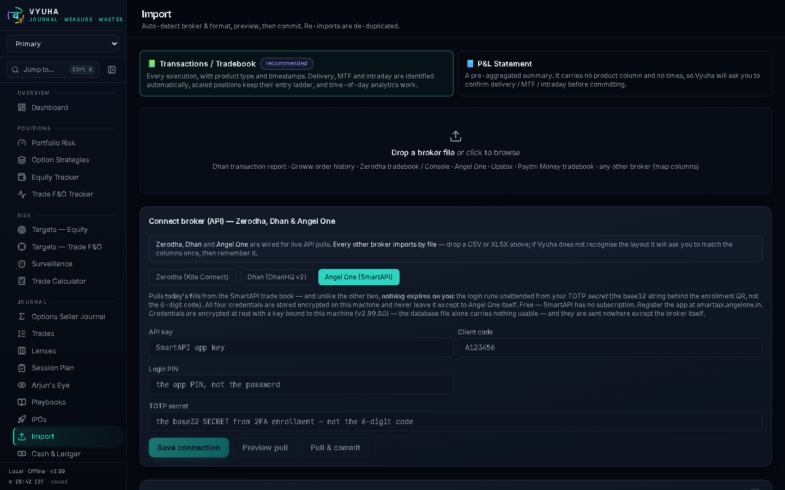

- **Three live API pulls.** Zerodha (today's executions with fill times), Dhan (the only Dhan source that states **MTF** outright), and **Angel One** — the one that needs no daily attention, because each pull mints its own login code from your TOTP secret.
- **Credentials are encrypted at rest**, bound to this machine, redacted from backups, and sent nowhere except the broker. A broken vault refuses to save a credential rather than quietly storing it in the clear.
- Pasting the 6-digit authenticator **code** where the **secret** belongs is caught at save with an explanation — not discovered the next morning as a cryptic login failure.

### 🪜 Staged positions — build in tranches, scale out in parts
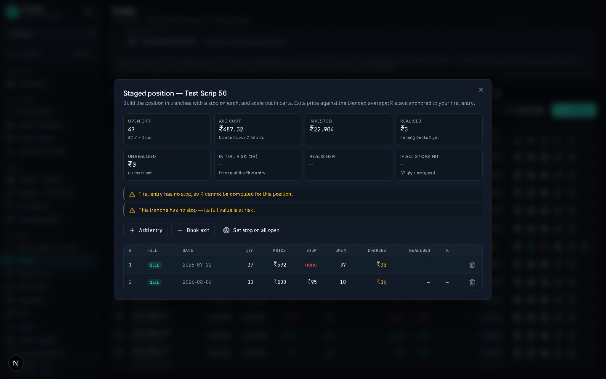

- **Add entries as the trade proves itself**, each tranche with its own stop and target — or set one stop across every open tranche in a click. **Book partial exits** on any trade (25/50/100% or any quantity) and let the rest run.
- **Three rules, chosen deliberately:** exits price against the **blended average** (so your journal never disagrees with your broker's average price); quantity is consumed **FIFO** (money is fungible, stops are not — the surviving tranche keeps *its* stop); and **R is frozen at your first entry**, so a 3R stays a 3R whether or not you pyramided.
- **Charges are booked per fill** — brokerage per order, STT per execution, DP once per exit *day*, MTF interest per tranche from its own entry date. Scaling into options really does cost ₹20 an order, and Vyuha says so instead of hiding it in an average.
- **Imports rebuild the ladder for you.** Zerodha, Angel One and Upstox tradebooks list every execution — those fills are preserved, so a scaled position arrives with its real shape. An ordinary buy-then-sell stays an ordinary trade.
- **Two warnings worth having:** *averaging down* (adding below your average — inverted correctly for shorts), and *open risk now exceeds your initial risk* — which fires on any add you didn't fund by trailing the earlier stops up.

### 👁 Arjun's Eye — the trader's cockpit
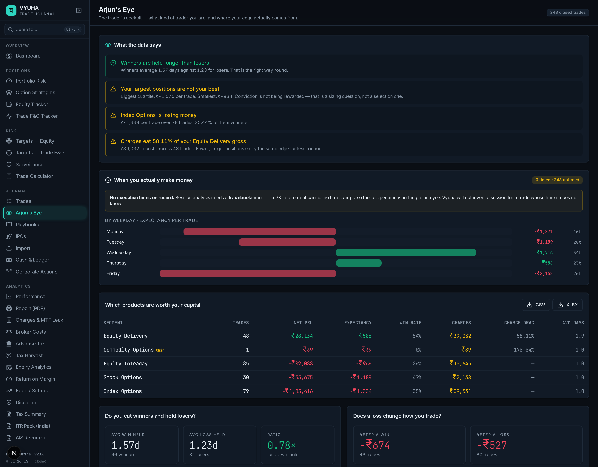

- Every other report answers *how did my money do*. This one answers **what kind of trader am I, and where does my edge actually come from**.
- **When you actually make money** — expectancy by Indian session (opening drive · morning trend · midday chop · afternoon push · closing hour) and by weekday.
- **Do you cut winners and hold losers?** The single most common structural leak in retail trading, invisible in a P&L total.
- **Does a loss change how you trade?** Expectancy after a win vs after a loss, plus same-day re-entries — revenge trading, measured.
- **Is your conviction rewarded?** Expectancy by position-size quartile. If your biggest positions are not your best, that is a *sizing* question, not a selection one.
- **Three honesty rules enforced in code:** no finding below 15 trades in a group; no invented sessions for trades whose time is unknown; and every finding phrased as an observation, never an instruction — there is a test asserting no finding says "you should".

### 📋 Trades table — how many, at what, for how much
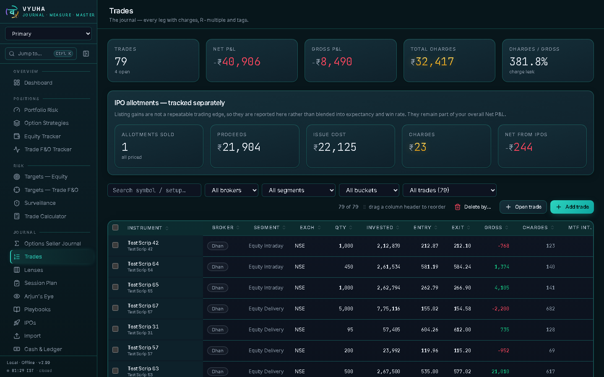

- **Qty · Invested · Entry · Exit** replaced the raw Buy/Sell rupee totals (v2.99.96): the quantity, what you actually put in, and the two weighted-average prices — universal, because every import path (six parsers, the column mapper, three API pulls) already produced them.
- On **MTF rows, Invested is *your own* contribution** with the broker-funded amount alongside; when the funding split is not yet resolved it says so instead of inventing a percentage.
- An open trade shows **"—" for its exit, never ₹0**, and sorts to the bottom of an Exit sort — a missing side is `undefined`, not zero.

### 🔎 See exactly the trades you mean

- One dropdown on **Trades** covers both questions: **status** (Open · Closed · Staged) and **outcome** (In gain — open · In loss — open · Profit — closed · Loss — closed).
- **Every option carries its own live count**, computed after your other filters — so you can see a view is empty before you choose it, and the numbers always add up: open + closed = all.
- **An open position with no mark price appears in neither "in gain" nor "in loss"** — because it has no unrealised result. Vyuha stores 0 for an unmarked holding, and reading that 0 as breakeven would file it under a result it never had. The count of unmarked positions is stated on screen instead of leaving a silent shortfall.

### 🧾 Reads the product type out of the charges themselves

- Dhan's **Global Transaction Report** has no product column — but India levies statutory charges at *different rates per product*, so the rate is a fingerprint. Stamp duty **0.015%** on a delivery buy vs **0.003%** intraday, corroborated independently by STT (**0.1%** both legs vs **0.025%** sell-only). Two witnesses agreeing on **89 of 92 rows** of a real report.
- **A bill that mixes both is split algebraically.** Stamp duty is linear in value, so "bought 3,600, squared 1,800 same day" has exactly one solution. Labelled *derived* — it is arithmetic on a total, not a stated fact.
- **MTF is still never claimed**, and that was verified rather than assumed: `Oth. Charges` totalled **₹0.03** across 92 rows and GST was 18% of (brokerage + txn + SEBI) to within **₹0.01**. No unexplained rupee, nowhere for financing to hide. So Vyuha asks about the *delivery* rows only — intraday and F&O can never be MTF.
- **Legs pair same-day first, then FIFO across dates, into real positions** — the exchange nets a scrip's same-day buy and sell before anything reaches delivery (verified against Paytm Money's own lot statement, 2026-08-20), and oldest-first for the rest is how the Income Tax Act treats equity delivery, so holding periods agree with the ones that decide STCG vs LTCG. Shares sold that the file never shows being bought become opening sells with the basis left blank. A conservation check asserts not one share or rupee is created or lost.
- **The broker's own charges are stored as truth.** Vyuha cannot be more accurate about a charge than the charge itself; its computed figures stay alongside as a cross-check.

### 🏦 MTF, answered by the broker rather than guessed

- Every Dhan **file** is silent about margin funding — MTF and delivery carry identical STT and stamp duty, and financing interest is booked to the ledger, not the contract note. So Vyuha stopped guessing and went to the two places that actually know.
- **Dhan API** (`Import → Connect broker`): `productType` returns **MTF** outright. Stated, not inferred — those rows need no confirmation at all.
- **Dhan ledger** (`Cash & Ledger`): MTF interest is calculated daily and posted **weekly**, so the ledger holds the real number. Vyuha imports it and shows **actual vs its own estimate side by side** — a comparison, never a correction, because splitting a weekly account-level posting across positions would invent an allocation the broker never made.
- The ledger parser finds columns by **header keyword, not position**; matches MTF **first** so a generic "charges" rule cannot swallow it; treats opening-balance rows as **assertions, not entries**; and **lists anything it cannot classify** rather than filing a guess.

### 🎟 IPO allotments become real holdings

- IPO shares are **credited, never bought**, so the holding arrives with no cost basis *and* no mark price — unable to be valued, unable to be scored. Vyuha surfaces those holdings instead of letting them sit dead.
- **"This came from an IPO"** creates a linked record seeded from the holding. The **issue price is left blank on purpose** — it is the one fact only you know, and guessing it would defeat the point.
- Fill it in and the IPO record becomes the **source of truth**: issue price (minus category discount) supplies the basis, listing price supplies the mark, an exit price closes the position and books the P&L, and the allotment date starts the tax holding period. One place, so the numbers can never drift.
- With no listing price it stays **honestly unmarked** — basis supplied so it rejoins the statistics, but no mark invented.

### 🎟 Sold something you never bought? It says so instead of scoring a win

- Sell an IPO allotment and the tradebook holds the sale and nothing else — shares are credited on allotment and never appear as a buy. With a buy value of zero the arithmetic reads it as a **100% winner, every time**.
- Those trades are **counted in cash but quarantined from every edge statistic** — win rate, expectancy, profit factor, ROM — until you set a cost.
- **Vyuha recovers that cost from the file's own footer.** The rows omit the purchase, but the broker's gross P&L includes it, so subtracting everything matchable leaves what it must have cost. On a real report: −₹8,268.27 matched against a −₹8,489.60 footer left −₹221.33 for one holding — 37 shares sold for ₹21,904, implying **₹597.98 a share**. Pre-filled for confirmation, never applied silently.
- IPO P&L is reported **apart from trading edge** — a listing-day pop is not a repeatable skill.

### 📥 Import that tells you what kind of file you brought

- Two clearly-labelled kinds, because they are **not equivalent**. A **tradebook** states the product and the time; a **P&L statement** states neither.
- So the P&L path **asks once, before commit** — grouped by symbol, with a guess pre-selected. Changing a product **re-prices immediately**, because charges, MTF interest and ROM all derive from it.
- Same-day round trips are *inferred* as intraday. **MTF is never inferred** — it is indistinguishable from delivery in a P&L file — so the default is delivery, the safest wrong answer, and guessed rows are labelled *assumed*.

### 📐 Return on Margin — what your capital actually earned
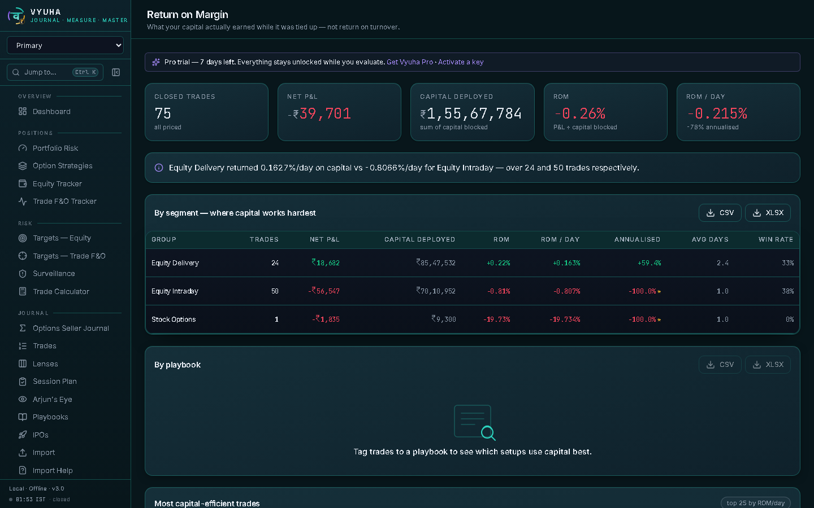

- Every Indian F&O journal reports P&L against **turnover** or **notional**. Both are close to meaningless: a long option and a short strangle can carry identical notional while tying up wildly different capital. **ROM measures against what was actually blocked.**
- The denominator is **instrument-aware**, because the market is — **long options** cost the premium and block no SPAN margin; **short options** block against the *underlying* (a ₹10,000 credit can tie up ₹1.5 lakh); **futures/intraday** block a percentage of contract value; **MTF** blocks only your own capital; **delivery** blocks the lot.
- **ROM/day is weighted by capital-days**, so ₹1L held ten days counts as ten times the commitment of ₹1L held one — and a scalper and a swing trader finally become comparable.
- Grouped by segment and playbook, so you can see that your F&O book returns *x*%/day on margin while delivery returns *y*% on capital. **No other Indian journal does this.**
- Annualised figures are **clamped and marked** — a book losing 10%/day extrapolates to −3,887%, which is arithmetically true and impossible. Honest beats impressive.

### 🔬 Numbers that explain themselves
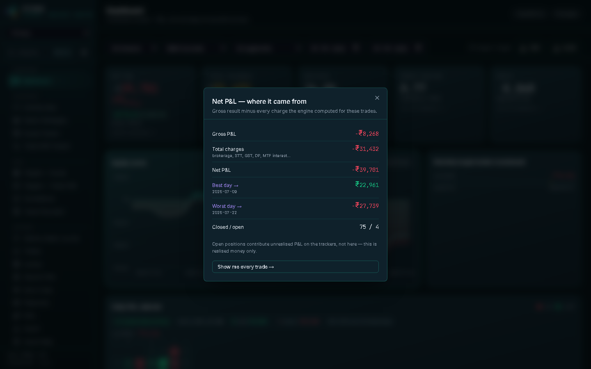

- **Every headline KPI is clickable** — 16 cards across Dashboard, Portfolio Risk, Equity Tracker and Trade F&O Tracker. Hover lifts and glows; click (or `Enter`) opens the breakdown.
- **And the breakdown goes somewhere.** Best/worst-day rows deep-link to `/trades` filtered to that date, and the rows shown **add up exactly** to the figure you clicked — an e2e test asserts the reconciliation, because a link showing roughly-related trades is worse than no link.
- Not a tooltip — a **derivation**: Net P&L splits into gross minus every charge with your best and worst day *and their dates*; Open Risk @ SL sits next to initial risk with the unstopped-position count, so you can see trailing a stop move the number; MTF funded shows effective leverage and how much of your paper gain interest has already eaten.

### 📚 Playbooks & discipline
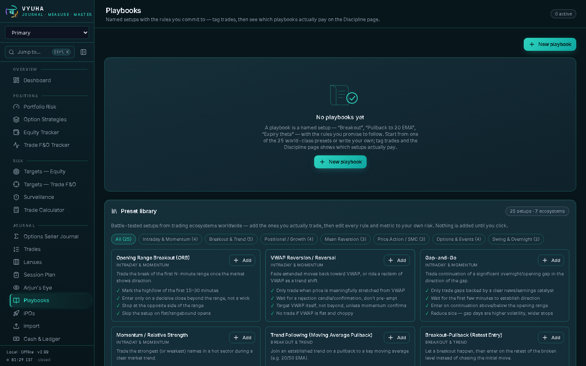

- **Browsable preset library — 25 playbooks across 7 global ecosystems** — Intraday & Momentum, Breakout & Trend (Turtle, Darvas, 52-week-high), Positional/Growth (CANSLIM, Minervini SEPA, Wyckoff, Weinstein), Mean Reversion (Connors RSI-2), Price Action/SMC (ICT liquidity sweeps), Options & Events (iron condor, **India weekly expiry theta**), Swing & Overnight (**BTST**). Filter by ecosystem, read every rule on the card, **one-click Add**, then tune every metric to your own risk. Nothing is auto-seeded — 25 untraded setups would bury your real playbooks and turn per-playbook expectancy into noise, so a playbook only becomes yours when you click.
- **Rule-checklist enforcement**: journaling a trade shows its playbook's rules — tick what you actually followed. Broken rules land on the Discipline page with their real cost.
- **Per-playbook expectancy cards**: win rate, net, expectancy, profit factor, avg R — with a small-sample caution until 20 closed trades.
- **Discipline scorecard**: weekly adherence scores, cost-of-mistakes rollup, trading-by-emotion, entry-time limit breaches, and the per-rule cost table.

### 📉 Options Seller Journal
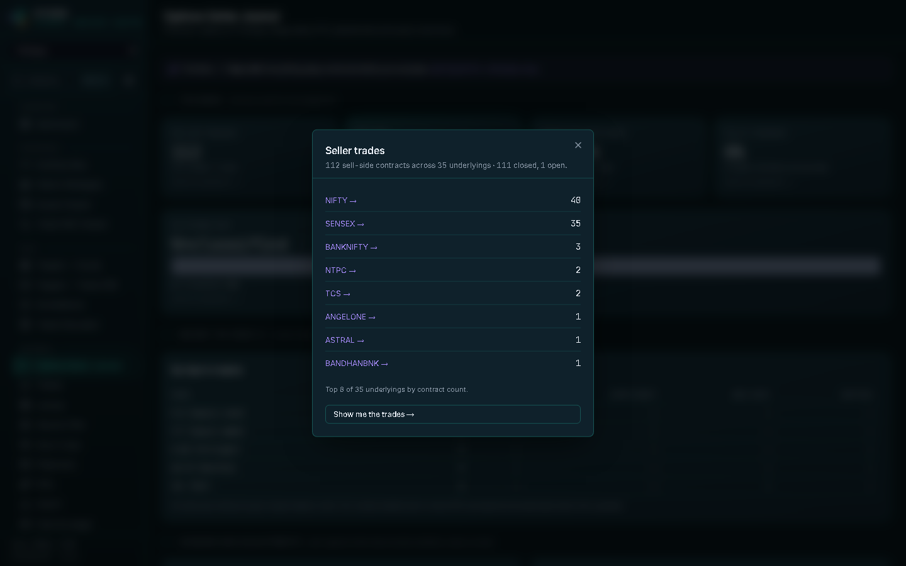

- Expectancy by **DTE band**, hedged-vs-unhedged reported as an honest gap, **roll chains** against the first leg, IV rank, and premium per day of risk.
- The four seller KPIs and the outcome mix open the same **breakdown dialog** the Dashboard uses — per-underlying counts, realised vs open, best and worst contract, capture arithmetic in one sentence — each row a deep link into the trades it counts.

### 🛡 Portfolio risk cockpit
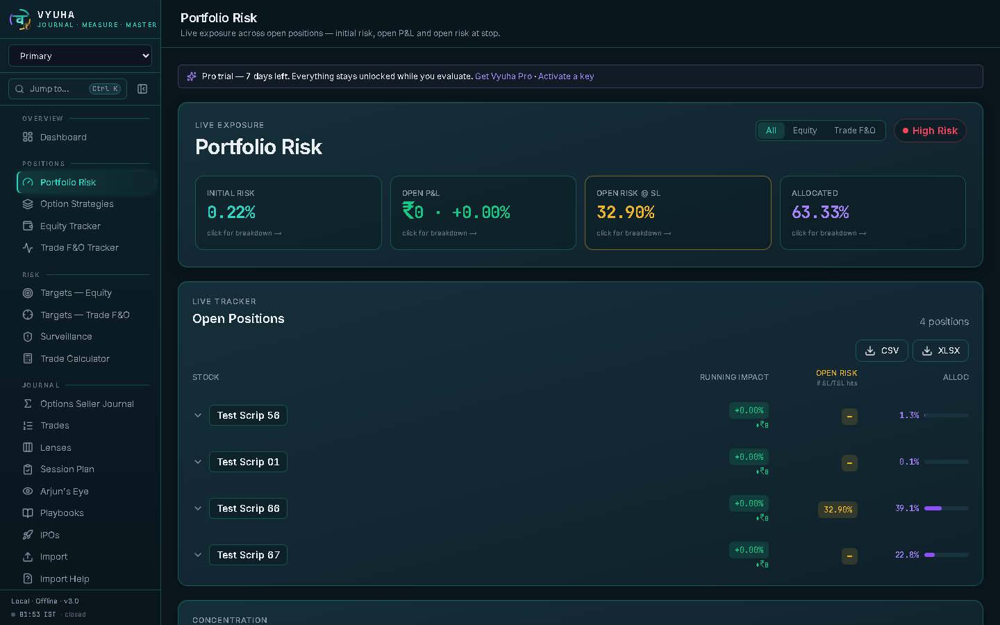

- Live exposure: initial risk, open P&L, **open risk @ SL**, allocation, sector concentration (HHI), one-click trail-to-breakeven.
- **VaR / CVaR / parametric VaR**, beta-weighted exposure, NIFTY stress scenarios (±3%, ±5%, crash+IV spike).
- **Option Greeks** (Black-Scholes) with a three-tier IV fallback ending at the real **India VIX**.
- **Margin estimate** (SPAN approximation) per broker × segment, fully editable rate table.
- **Physical-settlement radar**: ITM stock options and futures near expiry get delivery-obligation and extra-STT warnings.
- **Pre-trade limits check** (per-trade cap, daily stop, max-open, concentration) — advisory with override, and overrides are *recorded* so you see what ignoring the guardrails cost.
- **SL/TSL/target breach alerts** on Dashboard & Risk with opt-in desktop notifications — every alert reminds you the marks are EOD/manual and to verify live.
- **SEBI compliance radar** — date- and position-aware reminders for expiry-day margin rules, the weekly-expiry regime and index position limits. Informational only; your broker's RMS stays the source of truth.

### 🧮 Know your costs before you trade
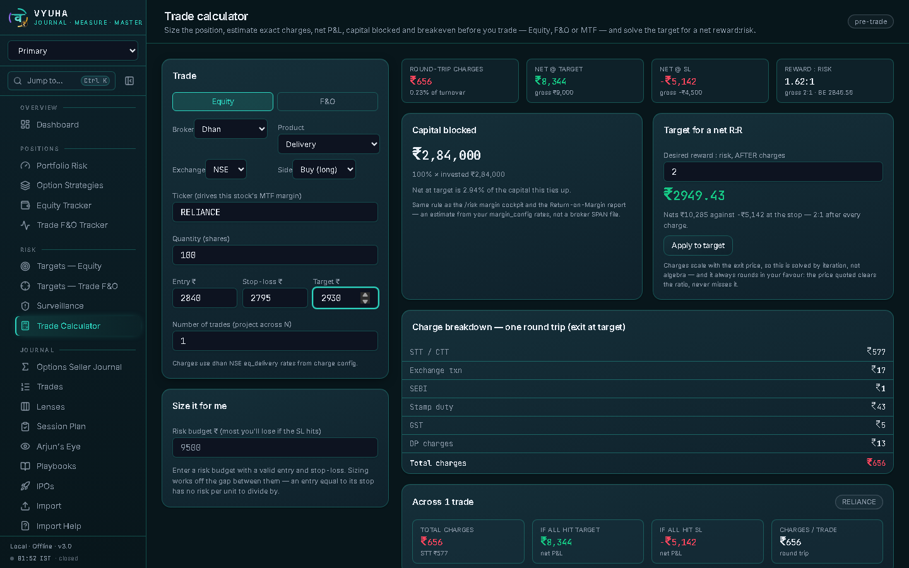

- **Trade calculator**: exact round-trip charges, net-at-target, net-at-SL, charge-adjusted reward:risk and breakeven — equity, F&O, or MTF, projected across N trades.
- **Charges & MTF leak report**: where your gross P&L actually goes.
- **Broker cost comparison**: your entire history re-priced on every broker's rate card — see who'd have been cheapest. **Free and paid plans are listed separately** (Kotak Neo's ₹249/month Trade Free Pro sits beside its free tier), with the subscription amortised over the months your trades span and counted in the total — a paid plan judged on brokerage alone always looks cheaper than it is.

### 📈 Edge analytics that don't flatter you
- Expectancy, win rate, avg R by **setup tag** and **segment**.
- **MAE/MFE excursions** from your own EOD price history, plus a **stop-tuning report** in R: how much heat your winners took, how many losers ran past 1R (late/moved stops — flagged as behavioral, not placement).
- Equity curve with max drawdown, daily P&L calendar, streaks, monthly target ladder, benchmark ingestion, Monte-Carlo utilities, XIRR.
- **Shareable stat cards** — post your numbers without posting your account size: defaults to *% of capital*, can hide ₹ entirely, and the PNG is rendered **on your machine** with a permanent *"self-reported · not broker-verified"* watermark.

### 🧾 India-grade tax tooling
- **Tax Summary**: STCG/LTCG with **31-Jan-2018 grandfathering** (per-share FMV), rate-cutover handling, dividend TDS tracking.
- **Advance tax** (234B/234C instalments), **tax-loss harvesting** scanner, **AIS/Form 26AS reconciliation**.
- **ITR Pack**: speculative vs non-speculative vs capital-gains segregation per FY, **ICAI Guidance Note turnover**, and a **44AB/44AD audit-applicability read** with layered cautions — export CSV/XLSX for your CA.
- **Schedule-format export** — the same figures emitted in the return's own item codes: **Schedule CG** (A3 for STCG u/s 111A, B4 for LTCG u/s 112A with the ₹1.25L deduction), **Schedule BP** for both business heads, and **Schedule CFL** with each loss vintage and the year it lapses. It also says which form your book implies — ITR-2, or ITR-3 the moment any intraday or F&O appears.
- **It gets the STT rule right, which a re-label would not.** STT is excluded from capital-gains deductions (proviso to S.48) but allowed in full as a business expense against intraday and F&O. Every other figure in Vyuha is net of STT, so the Schedule CG balance is deliberately *higher* than the net P&L shown elsewhere — the charge breakdown is stored per trade, so this is a fact here rather than an estimate.

### 🔄 Automation — with your consent, never without it
- **Opt-in EOD auto-MTM**: once per trading day, fetch NSE's bhavcopy and mark open positions to close. OFF by default; warns that it overwrites matched marks; skips silently offline; every run is audit-logged.
- **MTF interest accrual** runs idempotently on app open.
- **Signed auto-updates**: the desktop app checks once at launch and shows *Update now / Later* — nothing ever installs itself, and your DB is **backed up automatically before any migration**.

### 🎨 Appearance — nine skins, tint, panels, custom, wallpaper
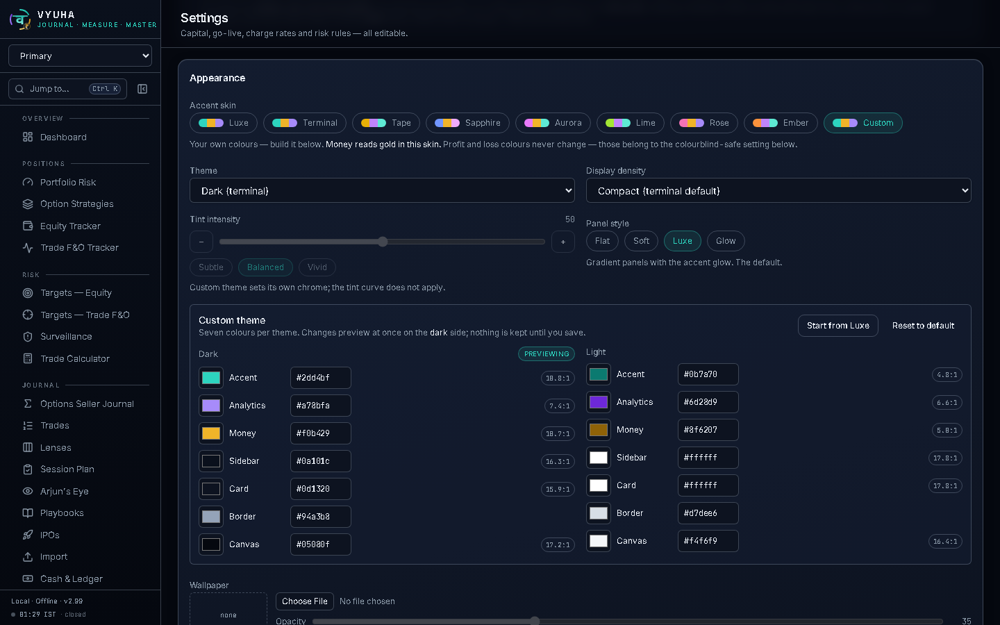

- **Nine skins**: eight built-in — Luxe, Terminal, Tape, Sapphire, Aurora, Lime, Rose, Ember — plus **Custom**. Every coloured skin tints canvas, panels and borders in its own hue, and a test asserts no two share a primary hex. (Ice and Royal, retired in v2.99.96, map to Sapphire.)
- **Tint intensity** — a 0–100 dial with Subtle / Balanced / Vivid presets deciding how much of the skin's hue the canvas, sidebar, cards and borders wear; every skin holds ≥9:1 (dark) / ≥7:1 (light) body-text contrast even at 100.
- **Panel style** — Flat / Soft / Luxe / Glow.
- **Custom theme** — seven targets (accent, analytics, money, sidebar, cards, borders, canvas) × dark/light, each row wearing a **WCAG readability badge** that warns and never blocks; seed it from any built-in skin.
- **Wallpaper** — PNG/JPEG/WebP ≤12 MB, kept locally in app-data **outside backups**, scrimmed per theme, never printed.
- The tokens are computed by a pure engine and injected inline on `<html>` — no first-paint flash, and charts stay literal-colour.

### 🗃 Operational depth
IPO tracker with allotment P&L · capital compounding (double-count-safe) · cash & ledger · corporate actions · symbol aliases · instrument/sector master · surveillance-list warnings · immutable **audit log** · one-file **backup/restore** · command palette (`Ctrl+K`) · collapsible sidebar with live IST market clock · light/dark, nine skins + colorblind-safe mode · toast notifications · animated, skeleton-loaded UI.

---

## 🔑 Licensing (for the maintainer)

Vyuha ships with an **offline licence gate** — an Ed25519 signature verified on the user's own
machine. Activation itself makes no server call and never has. Every fresh install begins a
**7-day full-Pro trial**; the core journal is free forever.

Vendor tooling lives in `scripts/`:

```bash
node scripts/license-issue.mjs buyer@email.com app              # mint a Lifetime key (also records it)
node scripts/license-issue.mjs buyer@email.com app --years 1    # ...or a Pro Annual key
node scripts/license-issue.mjs buyer@email.com app --machine ABCD-EF12-3456       # lock to one PC
node scripts/license-list.mjs --expiring 30                     # renewals due
node scripts/license-revoke.mjs A1B2-C3D4-E5 "refunded"         # bake into future builds
node scripts/revocation-publish.mjs --add A1B2-C3D4-E5 --message "Refunded — contact support."
                                                                # signed list; reaches live installs
```

Each key embeds the buyer's email in its signed payload, so no two are alike, and the app shows
"Licensed to &lt;email&gt;". Keys can optionally be **bound to one computer** via a hardware-derived
fingerprint — Windows `MachineGuid`, macOS `IOPlatformUUID`, or Linux
`/etc/machine-id`, each namespaced so the same value on two platforms cannot
collide. Revocation has two halves: a build-time list baked into each release, and
since v2.99.91 a **signed list fetched during the launch version check**, so a
refunded or leaked key stops working without waiting for the user to update. It
travels one way only — the list comes down, nothing about the user goes up — it
warns for a grace period before it locks, and it fails open when offline, which
is stated rather than hidden. Full procedures:
[`docs/owner/LICENSE_OPERATIONS.md`](docs/owner/LICENSE_OPERATIONS.md).

**Buying is a WhatsApp message.** Every "Get Pro / Get Lifetime" button in the app opens a
**buy dialog** — the number **+91 73936 73714**, a pre-filled message quoting the plan and the
price you saw, and *Copy number* / *Copy message* buttons (plus an Open-WhatsApp link when you are
in a browser). It is a dialog rather than a link because the app is offline by design and the
desktop webview opens no external pages; the key arrives by reply and is pasted into Settings →
License.

---

## 🔒 Local-first by design

No login. No cloud. No telemetry. No analytics SDKs.
Everything lives in **one SQLite file on your disk** — copy it and you've backed up your entire trading life. The desktop app talks to `127.0.0.1` and nothing else, with two download-only exceptions: at launch it asks GitHub for the latest signed release and the licence-revocation list — sending no account, no identifier and no data, and **not** something you can switch off — plus the opt-in bhavcopy fetch, which is off by default. Nothing about you or your trades is ever uploaded, by any path.

---

## 🚀 Get it

**Landing page:** https://thejesh-k463.github.io/VYUHA-LOG/ — features, screenshots, pricing and the comparison table.

**Desktop:** grab your platform's build from [**Releases**](https://github.com/Thejesh-k463/VYUHA-LOG/releases) — zero dependencies, Node.js is bundled, and your data persists in app-data across updates and reinstalls.

| Platform | File | Data lives in |
|---|---|---|
| **Windows** | `Vyuha_x.y.z_x64-setup.exe` | `%APPDATA%\in.vyuha.tradejournal` |

Current release: **v2.99.100**. If the window ever comes up blank, the sidecar's own log is at
`%APPDATA%\in.vyuha.tradejournal\logs\sidecar.log` — attach it to a bug report.

**What's free and what isn't:** every fresh install starts a **7-day full-Pro trial** — fully offline, no signup, no card. After that the **core journal is free forever**: recording closed trades, all six broker importers, the dashboard, staged positions, playbooks, the trade calculator, Lenses grouping with per-group delete, recoverable deletion, and backups. A licence unlocks the analytics layer — the Portfolio Risk cockpit, Arjun's Eye, Edge/Setups, Discipline, the Options Seller Journal and expiry analytics, the tax pack (Tax Summary, ITR, Advance Tax, Harvest, AIS reconcile), broker-cost and MTF comparison, per-group edge on Lenses, PDF reports, and live open-position tracking with SL/target. Your own record of your trading is never held hostage — every trade you have already taken stays readable, editable and exportable without a key — and nothing leaves your machine either way.

**New here?** Flip through the 📽 [**Getting-Started deck**](docs/client/GETTING_STARTED_DECK.html) — 13 visual slides covering install → import → journal → the playbook loop → Pro activation. (Download and open locally, or print to PDF; arrow keys navigate.)

**Run from source:**

```bash
git clone https://github.com/Thejesh-k463/VYUHA-LOG.git && cd VYUHA-LOG
npm install
npm run setup     # migrate + seed → ./data/vyuha.sqlite
npm run dev       # http://localhost:3000
```

---

## 🗂 Where things live

```
app/         Next routes — one folder per page, plus /api
components/  UI, grouped by feature (trades, import, cash, dashboard…)
lib/
  engine/    charges, classification, rate tables — pure, no DB
  analytics/ every report's maths — pure, no DB, no React
  import/    parsers (one per broker file), pairing, product inference
  risk/      position sizing, limits, margin
  queries/   the ONLY layer that touches the database (server-only)
  domain/    shared constants and vocabulary
drizzle/     migrations, applied in order at startup
tests/       2542 unit + integration tests across 167 files (+ tests/load: 15 load cases, run separately)
e2e/         45 Playwright flows through the real app, in 17 specs
docs/
  client/    what a BUYER gets — install guide, getting-started deck
  owner/     VENDOR ONLY — licensing, release, monetization, indicators
  sales/     public marketing assets (landing page, brochure)
  screenshots/  23 shots retaken by scripts/retake-screenshots.mjs — dashboard, trades, lenses,
                pricing, broker-connect, staged-position, arjuns-eye, rom-report, kpi-drilldown,
                playbooks, calculator, risk, options-journal, edge-report, tax-pack, surveillance,
                settings-appearance, custom-theme, skin-{lime,rose,ember,sapphire,aurora}
scripts/     build, release, and the vendor licence tooling
```

The rule that keeps the maths honest: **`lib/analytics/*` and `lib/engine/*`
import neither the database nor React.** They take plain data and return plain
data, which is why every number in the app can be unit-tested without a browser
or a fixture database — and why a reporting bug can be reproduced in three
lines.

## 🧪 Built like an engine, not a spreadsheet

- **2,542 tests.** Most run over pure, DB-free modules — charge engine, classification, MTF interest, capital gains, VaR, Greeks, settlement, discipline, ITR turnover, breach detection, MAE/MFE… A handful deliberately do not: backup/restore and multi-account isolation are exercised against a real migrated SQLite file, because the failures worth catching there (a wiped attachment directory, a half-applied restore, one account's rows leaking into another's tax pack) cannot occur in a mock.
- **Load-tested.** 15 load cases in [`tests/load`](tests/load/README.md) (`npm run test:load`, deliberately outside `npm test`) drive the app at ten-thousand-trade scale — cross-source duplicate detection, delete-at-scale, staged-leg depth, Lenses grouping, backup/restore. The first batch of seven found **five real defects**, the second batch found more, and the third (C8, 2026-08-21) found a **quadratic in the import pairing engine that no other case could see, because none of them imported it** — all fixed and pinned, each measured before/after in that README: a quadratic duplicate filter (8 s → 20 ms), a `too many SQL variables` throw on a whole-account delete, a staged rebuild with zero transactions, a per-batch re-filter in Lenses, a restore that derived its scrypt key twice, and a FIFO lot walk that cost 15.9× for 4× the legs (50,000 legs on one symbol: 775 ms → 63 ms, byte-identical output).
- Charges reconciled against **real broker files**; MTF math verified against **Dhan/Zerodha/Groww's own documentation**.
- Next.js (App Router) + TypeScript · Tailwind v4 · Drizzle ORM / better-sqlite3 · Recharts · TanStack Table · Tauri 2 desktop shell with a bundled-Node sidecar.
- Full changelog in [`CHANGELOG.md`](CHANGELOG.md).

<details>
<summary><b>📜 Key npm scripts</b></summary>

| Script | What it does |
| --- | --- |
| `npm run dev` | Start the app on localhost:3000 |
| `npm run build` / `npm run start` | Production build / serve |
| `npm run setup` | `db:migrate` + `seed` in one go |
| `npm run db:generate` / `db:migrate` | Generate / apply Drizzle migrations |
| `npm run db:studio` | Inspect the DB in Drizzle Studio |
| `npm test` | Vitest unit + integration suite (2,542 tests) |
| `npm run test:e2e` | Playwright e2e — 45 flows incl. the Dhan transaction report, Lenses grouping and drill-down, delete-by-scope, unpriced-sale quarantine, status/outcome views, the backup export→restore round trip and account switching |
| `npm run test:load` | 15 load/stress cases (`tests/load`, `.load.ts`) — outside `npm test` and CI by construction; results append to a gitignored trend file |
| `npm run demo` | Serve the app on localhost:3214 against a throwaway, freshly-seeded demo database — the real journal is never opened (`-- --fresh` rebuilds it) |
| `npm run typecheck` / `npm run lint` | `tsc --noEmit` / ESLint |
| **`npm run verify`** | **typecheck + lint + tests + production build — run this before pushing.** The first three pass on code that cannot be bundled; only the build catches a client-boundary violation |
| `npm run bump-version x.y.z` | Sync the version across package/tauri/cargo/sidebar |
| `npm run desktop:build` | Build the native desktop app for the CURRENT platform (needs Rust; see below) |

</details>

<details>
<summary><b>🖥 How the desktop app works</b></summary>

Vyuha is a full-stack Next.js server (server actions + better-sqlite3), so it can't be a static
export. The Tauri shell spawns the Next **standalone** server as a **bundled-Node sidecar** bound to
`127.0.0.1`, waits for the port, then points the native webview at it — WebView2 on Windows, WKWebView
on macOS. On first run the launcher copies a seeded template DB (empty journal) into the OS app-data
dir (`%APPDATA%\in.vyuha.tradejournal`, or `~/Library/Application Support/in.vyuha.tradejournal`);
your data persists there across updates and reinstalls. The sidecar's stdout/stderr go to
`<data-dir>/logs/sidecar.log` (`%APPDATA%\in.vyuha.tradejournal\logs\sidecar.log` on Windows).

```bash
# one-time prerequisites
#   Windows : Rust + WebView2 + MSVC C++ build tools
#   macOS   : Rust + Xcode Command Line Tools (xcode-select --install)
npm run desktop:build
# → Windows: src-tauri/target/release/bundle/nsis/
# → macOS:   src-tauri/target/release/bundle/dmg/
```

`desktop:build` builds for **whichever platform you run it on** — there is no cross-compilation, so a
macOS build needs a Mac. That is what the release matrix is for.

Releases are built by CI on tag push (`v*`) across a matrix — Windows x64, macOS Apple silicon and
macOS Intel (macOS is built by CI but not sold or supported) — signed with the updater keypair and published as **drafts**, so updates only reach
users when a draft is explicitly published. macOS ships per-architecture rather than as one universal
binary because the app carries a bundled Node runtime, and a universal bundle would embed a
single-architecture Node that fails on the other kind of Mac.

</details>

<details>
<summary><b>⚙️ Configuration & data</b></summary>

- **Database:** `data/vyuha.sqlite` (git-ignored). Reset: delete `data/`, run `npm run setup`.
- **Capital model:** two buckets (Equity / Trade F&O), editable in Settings; every risk %, allocation and target computes against bucket capital, with opening snapshots kept in sync.
- **Nothing statutory is hard-coded:** all charge rates live in `charge_config` (broker × segment × exchange) and margin rates in `margin_config` (broker × segment) — both editable in-app, in Drizzle Studio, or via the seed files.
- **Known limits:** broker P&L files lack segment/MTF flags and per-trade dates — re-tag those rows once (overrides persist across re-imports). Brokerage/MTF interest can't be derived from scrip-aggregated files; the reconciliation panel surfaces the deltas.

</details>

<details>
<summary><b>🗂 Project layout</b></summary>

```
VYUHA-LOG/
  app/            # App Router pages (dashboard, risk, trackers, reports…)
  components/     # UI primitives, layout, feature components
  lib/
    engine/       # PURE classification + charges engines
    analytics/    # PURE metrics, tax, ITR, MAE/MFE, greeks, VaR…
    risk/         # PURE calculators, margin, alerts
    import/       # parsers, detect, dedup, commit pipeline
    jobs/         # MTF accrual, auto-MTM
    db/           # Drizzle schema, migrations, seed
  src-tauri/      # Rust desktop shell
  tests/          # 2542 Vitest unit + integration tests (+ tests/load)
```
Convention: business logic lives in pure modules with zero DB/React imports, unit-tested first,
then wrapped by thin server-only query layers.

</details>

---

## ⭐ If Vyuha saves you one bad trade…

…that's worth more than a star — but the star helps others find it. **[Star the repo](https://github.com/Thejesh-k463/VYUHA-LOG/stargazers)** and share it with a trader who still journals in Excel.

> **Disclaimer:** Vyuha is a journaling and analytics tool. Nothing in it is investment, tax, or
> legal advice. Charge/tax figures are computed from editable, documented rates and reconciled
> where possible, but your broker's contract notes and your CA remain the source of record.
